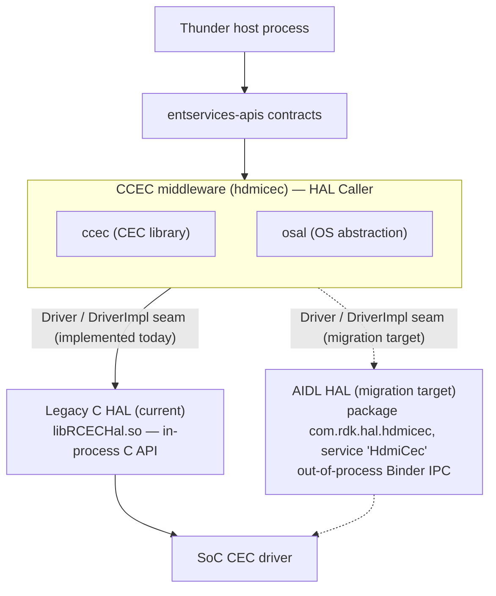
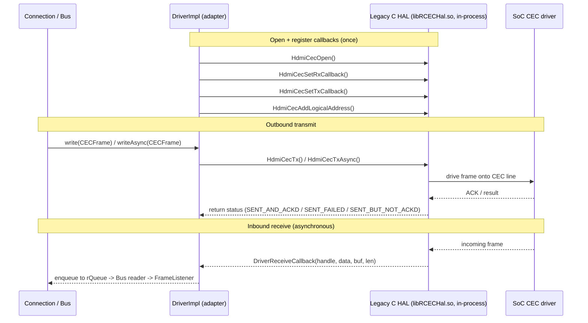
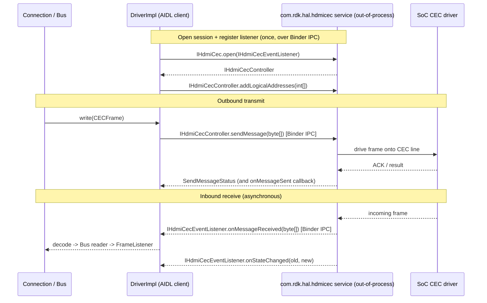

# HDMI-CEC (CCEC) Middleware

`hdmicec` is the RDK **CCEC middleware module** — a C++ **CEC middleware library (`ccec`)** paired with an **OS Abstraction Layer (`osal`)**. It is the HDMI-CEC HAL **"Caller"**: it *consumes* a Hardware Abstraction Layer (HAL) beneath it and serves the Thunder service plugins above it, but it does **not** implement the HAL itself. The module owns the CEC **high-level protocol** — device discovery, logical-address allocation, and message encode/decode/dispatch — while the HAL beneath it owns the **low-level protocol** (electrical timing, bus arbitration, retries, and ACK sampling). `Source: hdmicec/rdk_env.xml`, `Source: hdmicec/ccec/`, `Source: hdmicec/osal/`.

This module is the middleware tier of the *Bundle 1: RDK-V — CEC HAL Migration* workspace, whose goal is migrating the HDMI-CEC HAL boundary from the **legacy C API** to **AIDL/Binder**. That migration is confined to a single adapter class (`DriverImpl`) behind the abstract `Driver` contract, which is why both HAL backends are documented side-by-side below. `Source: README.md`, `Source: hdmicec/ccec/include/ccec/Driver.hpp`.

> This README is also the **main page** for the generated Doxygen API reference (both `ccec/Doxyfile` and `osal/Doxyfile` point `USE_MDFILE_AS_MAINPAGE` here). For the annotated, browsable API, generate the Doxygen HTML as described in [Configuration](#6-configuration).

---

## Table of Contents

1. [Purpose and Overview](#1-purpose-and-overview)
2. [Key Components](#2-key-components)
3. [Architecture Fit](#3-architecture-fit)
4. [Dependencies](#4-dependencies)
5. [Use Cases](#5-use-cases)
6. [Configuration](#6-configuration)
7. [Data Flows](#7-data-flows)
8. [Design Patterns](#8-design-patterns)
9. [Limitations](#9-limitations)
10. [Testing (L1/L2)](#10-testing-l1l2)
11. [HAL Interaction Diagrams](#11-hal-interaction-diagrams)

See also the companion architecture documents: [Architecture Overview](docs/architecture/overview.md), [HAL Interaction](docs/architecture/hal-interaction.md), and [Data Flow &amp; Concurrency](docs/architecture/data-flow.md).

---

## 1. Purpose and Overview

The `hdmicec` module implements the middleware that lets an RDK-V device participate on the **HDMI Consumer Electronics Control (CEC)** bus — the one-wire control channel that links a TV, set-top boxes, playback devices, audio systems, and other HDMI equipment so they can exchange commands such as *Image View On*, *Active Source*, *Standby*, and *Give OSD Name*.

Concretely, the module provides two things:

- **`ccec` — the CEC middleware library.** It manages the library lifecycle, exposes an application-facing `Connection` onto the CEC bus, runs the message-encode/decode pipeline, and defines the abstract HAL contract (`Driver`) that isolates the middleware from any specific silicon driver. `Source: hdmicec/ccec/include/ccec/LibCCEC.hpp`, `hdmicec/ccec/include/ccec/Connection.hpp`, `hdmicec/ccec/include/ccec/Driver.hpp`.
- **`osal` — the OS Abstraction Layer.** It supplies the threading and synchronization primitives (`Thread`, `Mutex`, `ConditionVariable`, `EventQueue`) on which the library's producer/consumer transport is built, keeping the CEC library portable across the underlying operating system. `Source: hdmicec/osal/include/osal/Thread.hpp`, `hdmicec/osal/include/osal/Mutex.hpp`, `hdmicec/osal/include/osal/ConditionVariable.hpp`, `hdmicec/osal/include/osal/EventQueue.hpp`.

Where it sits: `hdmicec` is the HAL **Caller**. The Thunder CEC service plugins (and the `entservices-apis` contracts they expose) call *into* CCEC; CCEC in turn calls *down* into the platform HAL, which drives the SoC's CEC hardware. Because the middleware owns only the high-level CEC protocol and delegates the electrical/low-level protocol to the HAL, the two HAL backends — the **Legacy C HAL** (currently implemented) and the **AIDL/Binder HAL** (the migration target) — are interchangeable behind one abstract contract. `Source: rdk-halif-aidl/hdmicec/current/docs/hdmi_cec.md`, `hdmicec/ccec/include/ccec/Driver.hpp`.

---

## 2. Key Components

The table lists the principal components. Signatures are documented **exactly as they exist** in the current headers (document-as-is). Components marked *(context only)* live under `ccec/src` and are described here for architectural context — they are not part of the annotated public API.

| Component | Role | Source |
|-----------|------|--------|
| `LibCCEC` | Library **facade** and lifecycle owner, reached through a shared `getInstance()` accessor. Public API: `static LibCCEC & getInstance(void)`, `void init(const char * name = 0)`, `void term(void)`, `int getLogicalAddress(int devType)`, `void getPhysicalAddress(unsigned int *physicalAddress)`, `int addLogicalAddress(const LogicalAddress &source)`. | `hdmicec/ccec/include/ccec/LibCCEC.hpp` |
| `Connection` | Application-facing **tap into the CEC bus** (send/receive). Public API: ctor `Connection(const LogicalAddress &source = LogicalAddress::UNREGISTERED, bool opened = true, const std::string &name = "")`, `open()`, `close()`, `addFrameListener()` / `removeFrameListener()`, `send(const CECFrame&, int timeout = 0)`, `sendTo(const LogicalAddress&, const CECFrame&, int timeout = 0)`, `sendToAsync()`, `sendAsync()`, `poll()`, `ping()`, `getSource()` / `setSource()`. | `hdmicec/ccec/include/ccec/Connection.hpp` |
| `Bus` *(context only)* | Internal **singleton** producer/consumer transport with inner `Reader` / `Writer` threads. Holds `std::list<FrameListener*> listeners`, `EventQueue<CECFrame*> wQueue`, `Mutex rMutex` / `Mutex wMutex`; exposes `start()` / `stop()`. | `hdmicec/ccec/src/Bus.hpp` |
| `Driver` | **Abstract** HAL contract accessed via `static Driver & getInstance(void)`. Declares the pure-virtual methods `open`, `close`, `read`, `write`, `writeAsync`, `addLogicalAddress`, `removeLogicalAddress`, `getLogicalAddress`, `getPhysicalAddress`, `isValidLogicalAddress`, `poll`, and `printFrameDetails`, plus an enum `{ SENT_AND_ACKD, SENT_FAILED = 1, SENT_BUT_NOT_ACKD }`. | `hdmicec/ccec/include/ccec/Driver.hpp` |
| `DriverImpl` *(context only)* | The **single concrete adapter** of `Driver` — the **migration seam**. Provides the static HAL callbacks `DriverReceiveCallback` / `DriverTransmitCallback` and an incoming `rQueue` (`typedef EventQueue<CECFrame*> IncomingQueue`). | `hdmicec/ccec/src/DriverImpl.hpp` |
| `MessageEncoder` | Encodes high-level CEC messages into raw `CECFrame` bytes via static `encode(...)` overloads. | `hdmicec/ccec/include/ccec/MessageEncoder.hpp` |
| `MessageDecoder` | Decodes a `CECFrame` back into a high-level message via `decode(const CECFrame&)`, dispatching the result through a `MessageProcessor`. | `hdmicec/ccec/include/ccec/MessageDecoder.hpp` |
| `MessageProcessor` | Base class with overloaded `process()` handlers, one per decoded message type; the defaults log the frame and take no further action, so applications **subclass** it to handle specific messages. | `hdmicec/ccec/include/ccec/MessageProcessor.hpp` |
| `FrameListener` | **Observer** interface: `virtual void notify(const CECFrame&) const = 0`, paired with `FrameFilter::isFiltered(const CECFrame&)` for selective delivery. | `hdmicec/ccec/include/ccec/FrameListener.hpp` |
| `CECFrame` | Raw CEC frame buffer. Declares `enum { MAX_LENGTH = 128 }` and backs it with `uint8_t buf_[MAX_LENGTH]`. | `hdmicec/ccec/include/ccec/CECFrame.hpp` |
| OSAL primitives | `Thread`, `Mutex`, `ConditionVariable`, `EventQueue`, `Runnable`, `Stoppable` — the OS-abstraction building blocks used by `Bus` for its producer/consumer model. | `hdmicec/osal/include/osal/` |

For the full component inventory and class relationships, see [Architecture Overview](docs/architecture/overview.md).

---

## 3. Architecture Fit

`hdmicec` occupies the **middleware** tier of the RDK-V HDMI-CEC software stack. Reading top-to-bottom:

1. **Thunder host process** — the WPEFramework/Thunder web-server framework that hosts the CEC service plugins. `Source: README.md`.
2. **`entservices-apis` (contracts)** — the COM-RPC/JSON-RPC interface contracts the CEC plugins expose to the rest of the system. `Source: README.md`.
3. **CCEC middleware (`ccec` + `osal`)** — *this module*. `ccec` provides the CEC library (lifecycle, connections, the message pipeline, and the abstract HAL contract); `osal` provides the OS-abstraction primitives the transport is built on. `Source: hdmicec/rdk_env.xml`.
4. **HAL beneath the middleware** — either the **Legacy C HAL** (the currently implemented backend: an in-process C driver declared in `hdmi_cec_driver.h`, shipped as `libRCECHal.so`) or the **AIDL HAL** (the migration target: an out-of-process AIDL/Binder service whose interfaces are declared in the package `com.rdk.hal.hdmicec` and which registers under the service name `HdmiCec`). `Source: rdk-halif-hdmi_cec/include/hdmi_cec_driver.h`, `rdk-halif-aidl/hdmicec/current/com/rdk/hal/hdmicec/`.
5. **SoC CEC driver** — the vendor silicon driver that owns the physical CEC line. `Source: rdk-halif-aidl/hdmicec/current/docs/hdmi_cec.md`.

Because CCEC is the HAL **Caller**, both HAL backends are expressed behind the same abstract `Driver` contract: the middleware always calls `Driver`, and the single concrete `DriverImpl` implements those calls. Today `DriverImpl` is backed by the Legacy C HAL; the AIDL/Binder HAL is the target the adapter is being migrated toward — not a second run-time-selectable backend. This `Driver` / `DriverImpl` seam is the migration boundary. `Source: hdmicec/ccec/include/ccec/Driver.hpp`, `hdmicec/ccec/src/DriverImpl.hpp`.

**Diagram — Layered stack placement.** The solid arrow marks the backend implemented today; the dashed arrow marks the migration target.



Whichever backend `DriverImpl` is built against, everything above the seam (`LibCCEC`, `Connection`, `Bus`) sees only the abstract `Driver` contract. For a deeper treatment of stack placement and class relationships, see [Architecture Overview](docs/architecture/overview.md).

---

## 4. Dependencies

This is headless C/C++ middleware; its dependencies fall into three groups.

- **Runtime / build dependencies (declared).** The module declares its RDK build-time dependencies as `sdk` and `devicesettings`, and it is Coverity-supported. `Source: hdmicec/rdk_env.xml`.
- **Internal dependency.** The `ccec` library depends on `osal` for its threading and synchronization primitives; `osal` has no dependency on `ccec`. `Source: hdmicec/ccec/src/Bus.hpp`, `hdmicec/osal/include/osal/`.
- **Test-only dependencies.** The L1 unit tests require **Google Test (gtest) &ge; 1.10.0** and **Google Mock (gmock)**; these are pulled in only when the build is configured with `--enable-l1tests` and are not needed for a production build. `Source: hdmicec/configure.ac`, `hdmicec/tests/L1Tests/README.md`.

The build additionally probes for **GLib** (`glib-2.0 >= 0.10.28`) via `PKG_CHECK_MODULES`. `Source: hdmicec/configure.ac`.

The **documentation toolchain** (Doxygen, and optionally Graphviz for call/collaboration graphs) is used only to generate the API reference from the annotated headers; it is *not* a build or link dependency of the module and is not recorded in any production manifest.

---

## 5. Use Cases

The module is used by CEC service plugins (and by the L1 tests) to:

- **Initialize and tear down the CEC library** for the process lifetime — `LibCCEC::init()` / `LibCCEC::term()`. `Source: hdmicec/ccec/include/ccec/LibCCEC.hpp`.
- **Send CEC messages** onto the bus, either synchronously with a bounded timeout (`Connection::send` / `Connection::sendTo`) or asynchronously (`Connection::sendAsync` / `Connection::sendToAsync`). `Source: hdmicec/ccec/include/ccec/Connection.hpp`.
- **Receive CEC messages** by registering a `FrameListener` on a `Connection`; inbound frames are delivered to `notify(const CECFrame&)`. `Source: hdmicec/ccec/include/ccec/Connection.hpp`, `hdmicec/ccec/include/ccec/FrameListener.hpp`.
- **Manage logical / physical addresses** — allocate a logical address for a device type and query the device's physical address (`LibCCEC::addLogicalAddress`, `getLogicalAddress`, `getPhysicalAddress`). `Source: hdmicec/ccec/include/ccec/LibCCEC.hpp`.
- **Probe the bus** for the presence of devices at given logical addresses (`Connection::poll` / `Connection::ping`). `Source: hdmicec/ccec/include/ccec/Connection.hpp`.

**Illustrative usage — send an *Image View On* command to the TV.** The snippet below is illustrative and uses only the current public signatures; error handling and CEC types are elided for brevity.

```cpp
#include "ccec/LibCCEC.hpp"
#include "ccec/Connection.hpp"
#include "ccec/CECFrame.hpp"
#include "ccec/MessageEncoder.hpp"
#include "ccec/Messages.hpp"
#include "ccec/Operands.hpp"

// The CCEC public types live in the CCEC namespace scaffolding
// established by ccec/CCEC.hpp (CCEC_BEGIN_NAMESPACE / CCEC_END_NAMESPACE).

// 1. Initialize the library facade (lifecycle owner).
LibCCEC::getInstance().init("MyCecApp");

// 2. Open an application connection onto the CEC bus.
//    The constructor opens the connection by default.
Connection conn(LogicalAddress::PLAYBACK_DEVICE_1);

// 3. Encode a high-level CEC message into a raw CECFrame.
CECFrame frame = MessageEncoder::encode(ImageViewOn());

// 4. Send it to the TV (logical address 0). The timeout (ms) is an
//    upper bound so the caller does not hang; 0 means "do not retry".
conn.sendTo(LogicalAddress::TV, frame, 1000 /* ms upper bound */);

// 5. Tear down when finished.
conn.close();
LibCCEC::getInstance().term();
```

`Source: hdmicec/ccec/include/ccec/LibCCEC.hpp`, `hdmicec/ccec/include/ccec/Connection.hpp`, `hdmicec/ccec/include/ccec/MessageEncoder.hpp`, `hdmicec/ccec/include/ccec/CECFrame.hpp`, `hdmicec/ccec/include/ccec/Operands.hpp`.

---

## 6. Configuration

The module carries no runtime configuration file of its own; its "configuration" is build metadata plus the Autotools build system.

- **Component metadata — `rdk_env.xml`.** Declares the module's dependencies (`sdk`, `devicesettings`), its script paths, and `is_coverity_supported = True`. `Source: hdmicec/rdk_env.xml`.
- **Autotools build.** `configure.ac` declares the package as `hdmicec` version `1.0` and wires up the sub-`Makefile`s for `cfg/`, `osal/`, `ccec/`, and `tests/`; the optional `--enable-l1tests` flag turns on the L1 unit-test build (requiring `gtest >= 1.10.0`). `Source: hdmicec/configure.ac`.
- **Top-level `Makefile`.** A recursive build that builds `soc/$(PLATFORM_SOC)/common`, `osal/`, `ccec/`, and `tests/`, then installs the resulting `.so` libraries under `./install/lib`. `Source: hdmicec/Makefile`.
- **Build scripts.** `build.sh` defaults `PLATFORM_SOC` to `intel` and carries a Broadcom branch; `rdk_build.sh` is the RDK Build Framework entry point, offering the actions `configure`, `clean`, `build` (default), `rebuild`, and `install` across the `intel` / `broadcom` / `entropic` / `mstar` platforms. `Source: hdmicec/build.sh`, `hdmicec/rdk_build.sh`.
- **Packaged Autotools aux — `cfg/`.** Holds the Autotools auxiliary files, including `cfg/Makefile.am`. `Source: hdmicec/cfg/`.

**Generating the API documentation.** After the headers are annotated, generate the browsable HTML API reference with Doxygen:

```bash
# CCEC public API (uses this README as the Doxygen main page)
cd hdmicec/ccec && doxygen Doxyfile

# OSAL API
cd hdmicec/osal && doxygen Doxyfile
```

The generated `html/index.html` opens with this README as its landing page. `Source: hdmicec/osal/Doxyfile`.

---

## 7. Data Flows

CEC traffic is deliberately **asymmetric**: outbound frames have both a synchronous and an asynchronous path, while inbound frames always arrive asynchronously through a HAL callback. The summaries below give the end-to-end path; the full sequence diagrams and threading detail live in [Data Flow &amp; Concurrency](docs/architecture/data-flow.md).

- **Outbound transmit.** A plugin builds a message → `MessageEncoder` encodes it into a `CECFrame` → `Connection::send` / `sendTo` hands it to `Bus::send` → the frame is enqueued to the `Bus` write queue `wQueue` and drained by the writer thread → `DriverImpl::write()` → HAL → SoC. `Source: hdmicec/ccec/include/ccec/Connection.hpp`, `hdmicec/ccec/src/Bus.hpp`, `hdmicec/ccec/src/DriverImpl.hpp`.
- **Inbound receive.** SoC → HAL Rx callback → `DriverImpl::DriverReceiveCallback()` → the frame is placed on the `DriverImpl` incoming queue `rQueue` and drained by the `Bus` reader thread → delivered through `FrameListener` → `Connection` → `MessageDecoder` → `MessageProcessor`. `Source: hdmicec/ccec/src/DriverImpl.hpp`, `hdmicec/ccec/include/ccec/FrameListener.hpp`, `hdmicec/ccec/include/ccec/MessageDecoder.hpp`, `hdmicec/ccec/include/ccec/MessageProcessor.hpp`.

**On the transmit timeout.** The `timeout` parameter of `Connection::send` / `sendTo` is an **upper bound** on how long the call may block, so the application does not hang. Because the HAL transmit is synchronous, `Bus::send` retries the frame in **250 ms increments** until it succeeds or the budget lapses (internally `retry = timeout / 250`); a `timeout` of `0` means the frame is attempted once with no retry loop. `Source: hdmicec/ccec/src/Bus.cpp`, `hdmicec/ccec/src/Connection.cpp`.

---

## 8. Design Patterns

The module's structure is best understood through five recurring patterns, each tied to a concrete component:

- **Layered architecture** — CCEC is a well-defined middleware layer between the Thunder service plugins above and the HAL below, communicating with each through a narrow, explicit contract. `Source: hdmicec/rdk_env.xml`.
- **Adapter / migration seam** — the abstract `Driver` contract plus the concrete `DriverImpl` adapter isolate the code above the seam from any specific HAL. `DriverImpl` currently adapts the Legacy C HAL; the same seam is where the AIDL/Binder target is adopted, letting the migration proceed behind the stable `Driver` interface. `Source: hdmicec/ccec/include/ccec/Driver.hpp`, `hdmicec/ccec/src/DriverImpl.hpp`.
- **Producer / consumer** — `Bus` runs inner `Reader` and `Writer` threads over an `EventQueue<CECFrame*> wQueue`, decoupling the callers that enqueue frames from the thread that drains the queue to the HAL. `Source: hdmicec/ccec/src/Bus.hpp`.
- **Observer** — inbound frames are delivered through the `FrameListener` interface (`notify(const CECFrame&)`), letting multiple application listeners subscribe without the transport knowing their concrete types. `Source: hdmicec/ccec/include/ccec/FrameListener.hpp`.
- **Singleton / shared accessor** — the module's shared, process-wide services — `LibCCEC`, `Bus`, and `Driver` — are each reached through a `getInstance()` accessor. `Bus` enforces uniqueness with a **private constructor** (a true singleton), whereas `LibCCEC` and `Driver` declare **public constructors**, so their `getInstance()` provides a shared, conventional access point without preventing additional instances from being constructed. `Source: hdmicec/ccec/include/ccec/LibCCEC.hpp`, `hdmicec/ccec/src/Bus.hpp`, `hdmicec/ccec/include/ccec/Driver.hpp`.

For how these patterns relate across the module, see [Architecture Overview &sect; Design Patterns](docs/architecture/overview.md).

---

## 9. Limitations

The following are documented **as the code and the HDMI-CEC protocol currently reflect** — no aspirational behavior is implied.

- **Shared, process-wide services.** `LibCCEC`, `Bus`, and `Driver` are reached through `getInstance()`. `Bus` is a true singleton (private constructor); `LibCCEC` and `Driver` expose public constructors, so `getInstance()` is a shared accessor rather than a hard guarantee of a single instance. Treat these as process-wide services. `Source: hdmicec/ccec/include/ccec/LibCCEC.hpp`, `hdmicec/ccec/src/Bus.hpp`, `hdmicec/ccec/include/ccec/Driver.hpp`.
- **Frame buffer vs. protocol message size.** `CECFrame` reserves a fixed code-level buffer of `MAX_LENGTH = 128` bytes (`uint8_t buf_[MAX_LENGTH]`). `Source: hdmicec/ccec/include/ccec/CECFrame.hpp`. A real CEC message is far smaller: per the HDMI-CEC 1.4b protocol a complete frame is a header block plus an opcode block plus up to a handful of operand bytes — a maximum of **16 bytes** as documented by the HAL contract. `Source: rdk-halif-aidl/hdmicec/current/com/rdk/hal/hdmicec/IHdmiCecController.aidl`. The 128-byte buffer is therefore a generous code constant, not the protocol's message-size limit.
- **Bounded, synchronous transmit.** Transmission is bounded by the caller-supplied `timeout` (retried by `Bus` in 250 ms increments); there is no separate hard-coded transmit-duration constant in the middleware. Callers that must not block should use the asynchronous `sendAsync` / `sendToAsync` paths. `Source: hdmicec/ccec/src/Bus.cpp`, `hdmicec/ccec/src/Connection.cpp`.
- **Synchronous HAL and serialized access.** The HAL transmit is synchronous — it blocks until the frame is ACK-sampled or the attempt times out. The middleware does not assume the HAL is re-entrant; instead it serializes access through the `Bus` reader/writer threads and OSAL mutexes (`rMutex` / `wMutex`). `Source: rdk-halif-aidl/hdmicec/current/docs/hdmi_cec.md`, `rdk-halif-hdmi_cec/include/hdmi_cec_driver.h`, `hdmicec/ccec/src/Bus.hpp`.
- **Single active backend.** `DriverImpl` is built against one HAL backend at a time. The Legacy C HAL is the backend implemented today; the AIDL/Binder HAL is a compile-time migration target, not a second run-time-selectable backend. `Source: hdmicec/ccec/src/DriverImpl.hpp`, `hdmicec/docs/architecture/hal-interaction.md`.

---

## 10. Testing (L1/L2)

The `hdmicec` module ships its own **L1** (module functional / unit) test suite; **L2** and **L3** coverage lives outside the module in the plugin and HAL-conformance repositories.

**L1 — in this module.** The suite is built on **Google Test (gtest) v1.10.0+**, **Google Mock (gmock)**, **C++11**, and **Autotools**. It contains ~195+ CCEC tests (frame construction/serialization, connection management, the `LibCCEC` lifecycle and addresses, message encode/decode across all opcodes and operands, and the driver/bus) plus OSAL tests. `Source: hdmicec/tests/L1Tests/README.md`, `hdmicec/tests/L1Tests/QUICK_START.md`.

Build and run:

```bash
# Configure with L1 tests enabled, then build and run via the check target
./configure --enable-l1tests
make check

# Or build and run the L1 test binary explicitly
cd tests/L1Tests
make
./run_L1Tests
```

`Source: hdmicec/tests/L1Tests/README.md`.

The L1 tests isolate the middleware from real silicon using a **Google-Mock HDMI-CEC (legacy HAL) driver mock** plus a telemetry stub, both provided under `mocks/`. `Source: hdmicec/mocks/README.md`.

For details, see the L1 guides: [L1 Tests README](tests/L1Tests/README.md), [L1 Quick Start](tests/L1Tests/QUICK_START.md), the framework rationale in [UNIT_TEST_SETUP.md](UNIT_TEST_SETUP.md), and the mock catalogue in [mocks/README.md](mocks/README.md).

**L2 / L3 — outside this module.** Higher-level tests are not part of `hdmicec`. **L2** functional tests exercise the CEC Thunder plugins (`entservices-hdmicecsource`, `entservices-hdmicecsink`), and **L3** / HAL-conformance (VTS) tests live in the HAL test repository (`rdk-halif-test-hdmi_cec`). `Source: README.md`.

---

## 11. HAL Interaction Diagrams

The two backends beneath the `Driver` / `DriverImpl` seam interact with the SoC very differently. Both are shown here; the fuller treatment (including the migration adaptations the adapter must make) is in [HAL Interaction](docs/architecture/hal-interaction.md).

### 11.1 Legacy C HAL — in-process (currently implemented)

`DriverImpl` links against the vendor C library (`libRCECHal.so`) and calls its `HdmiCec*` C functions **in-process**. Transmission is synchronous; reception arrives through a registered Rx callback that lands in `DriverImpl::DriverReceiveCallback`. `Source: rdk-halif-hdmi_cec/include/hdmi_cec_driver.h`, `hdmicec/ccec/src/DriverImpl.hpp`.



### 11.2 AIDL/Binder HAL — out-of-process (migration target)

Under the AIDL contract, `DriverImpl` becomes a **Binder client**: it opens the `IHdmiCec` service (registered under the name `HdmiCec` in the package `com.rdk.hal.hdmicec`), obtains an `IHdmiCecController`, and drives transmission with `sendMessage()` over **Binder IPC** to the **out-of-process** HAL service. Inbound frames and status arrive asynchronously through the `IHdmiCecEventListener` callbacks the client registered. `Source: rdk-halif-aidl/hdmicec/current/com/rdk/hal/hdmicec/IHdmiCec.aidl`, `IHdmiCecController.aidl`, `IHdmiCecEventListener.aidl`.



Both diagrams are anchored on the real `Driver` / `DriverImpl` seam: everything above it is unchanged by the migration, and only the adapter's downward calls differ between the two backends.

---

## Related Documentation

- [Architecture Overview](docs/architecture/overview.md) — stack placement, component inventory, and class relationships.
- [HAL Interaction](docs/architecture/hal-interaction.md) — the Legacy C HAL and AIDL/Binder HAL paths and the migration seam, in depth.
- [Data Flow &amp; Concurrency](docs/architecture/data-flow.md) — outbound/inbound sequences and the `Bus` producer/consumer threading model.
- [L1 Tests README](tests/L1Tests/README.md) &middot; [L1 Quick Start](tests/L1Tests/QUICK_START.md) &middot; [Unit Test Setup](UNIT_TEST_SETUP.md) &middot; [Mocks](mocks/README.md).

