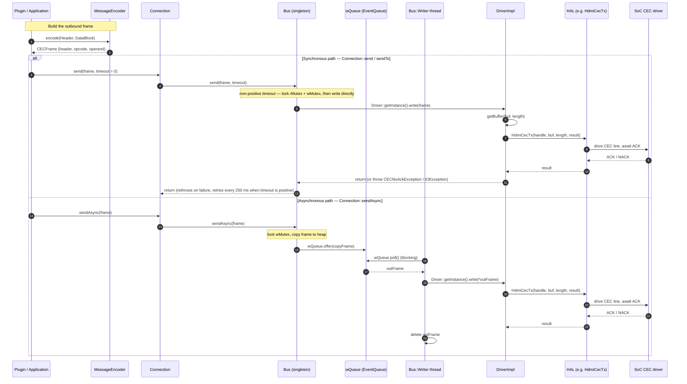
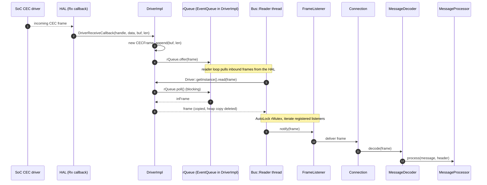
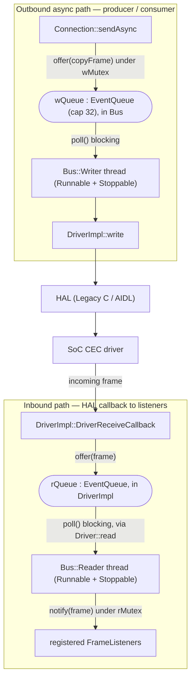

# hdmicec Data Flow & Concurrency

This document traces a CEC message end-to-end through the `hdmicec` (CCEC) middleware — **outbound** (host → HAL → SoC) and **inbound** (SoC → HAL → application) — and explains the `Bus` **producer/consumer** concurrency model that carries those messages. Everything here is anchored on the real `Driver` / `DriverImpl` seam and the actual member names found in the code; the flow *above* the seam is CCEC's responsibility, and the flow *below* it is delegated to whichever HAL backend is active (see [HAL Interaction](hal-interaction.md)).

The transport is deliberately asymmetric. Outbound frames have **two distinct paths** — a *synchronous* path that calls the HAL directly and an *asynchronous* path that queues the frame for a background writer thread — while inbound frames always arrive asynchronously through a HAL callback and are drained by a background reader thread. The sections below document each path exactly as implemented.

## Related documents

- [Architecture Overview](overview.md) — stack placement and the component/class relationships that this document animates.
- [HAL Interaction](hal-interaction.md) — how CCEC talks to **both** HAL backends (Legacy C HAL and AIDL/Binder HAL) below the `Driver` seam.
- [Module README](../../README.md) — module overview (purpose, key components, configuration, testing, and limitations).

---

## 1. Outbound Transmit

Outbound traffic starts with a high-level message being **encoded** into a raw `CECFrame`, and then leaves the middleware through one of two paths depending on which `Connection` API the caller invokes.

### 1.1 Building the frame

Before anything is sent, the application turns a high-level message into wire bytes with `MessageEncoder`. Its `encode(...)` methods are **static overloads** that serialise a message into a `CECFrame` in the fixed order **header → opcode → operand**: the header block is serialised first (`h.serialize(out)`), then the opcode (`OpCode(m.opCode()).serialize(out)`), then the message operands (`m.serialize(out)`). `Source: hdmicec/ccec/include/ccec/MessageEncoder.hpp`. The resulting `CECFrame` is a fixed-capacity byte buffer — `enum { MAX_LENGTH = 128 }` backing `uint8_t buf_[MAX_LENGTH]` with a `size_t len_` length. `Source: hdmicec/ccec/include/ccec/CECFrame.hpp`.

### 1.2 Synchronous path (`Connection::send` / `sendTo`)

`Connection::send()` / `Connection::sendTo()` forward the frame to the singleton transport as `Bus::send(frame, timeout)`; `Connection` holds a reference to the `Bus` (`Bus &bus`). `Source: hdmicec/ccec/include/ccec/Connection.hpp`. The behaviour of `Bus::send` then branches on `timeout`:

- **When `timeout <= 0`** (the default; `send` declares `int timeout = 0`), `Bus::send` takes **both** locks (`AutoLock rlock_(rMutex), wlock_(wMutex)`), verifies the bus is `started`, and calls `Driver::getInstance().write(frame)` **directly** — the frame is *not* placed on any queue. If the HAL write throws, the exception is rethrown to the caller. `Source: hdmicec/ccec/src/Bus.cpp`, `hdmicec/ccec/src/Bus.hpp`.
- **When `timeout > 0`**, `Bus::send` retries the synchronous write in 250&nbsp;ms increments until the budget is exhausted. It computes `int retry = (timeout / 250)` and loops: `usleep(1000)`, attempt `send(frame, 0)` (the direct branch above), and on failure `usleep(250000)` (250&nbsp;ms) before the next attempt, continuing `while (retry--)`. If the final attempt still fails, the exception is rethrown. `Source: hdmicec/ccec/src/Bus.cpp`.

The exact retry arithmetic (document-as-is):

```text
int retry = (timeout / 250);   // number of attempts derived from the timeout budget
do {
    usleep(1000);              // 1 ms settle before each attempt
    try { send(frame, 0); retry = 0; }   // delegate to the direct (timeout <= 0) branch
    catch (Exception &e) { if (retry == 0) throw; }
    if (retry) usleep(250000); // 250 ms back-off between attempts
} while (retry--);
```

`Source: hdmicec/ccec/src/Bus.cpp`.

### 1.3 Asynchronous path (`Connection::sendAsync`)

`Connection::sendAsync()` forwards to `Bus::sendAsync(frame)`. `Source: hdmicec/ccec/include/ccec/Connection.hpp`. Under `AutoLock lock_(wMutex)`, `Bus::sendAsync` verifies the bus is `started`, **copies the frame onto the heap** (`CECFrame *copyFrame = new CECFrame(); *copyFrame = frame;`), and enqueues the copy with `wQueue.offer(copyFrame)`; if `offer` throws, the copy is deleted and the exception is rethrown so no memory leaks. `Source: hdmicec/ccec/src/Bus.cpp`. The background `Bus::Writer` thread later drains the queue: it calls `bus.wQueue.poll()` (blocking), and for each non-null `outFrame` calls `Driver::getInstance().write(*outFrame)` before `delete`-ing it. `Source: hdmicec/ccec/src/Bus.cpp`.

### 1.4 The concrete HAL leg (`DriverImpl::write`)

Both paths converge on the same HAL call. `DriverImpl::write()` serialises the frame's bytes out with `frame.getBuffer(&buf, &length)` and, under its own `AutoLock lock_(mutex)`, hands them to the HAL — on the Legacy C HAL path this is `HdmiCecTx(nativeHandle, buf, length, &sendResult)`. A directed frame that is sent but not acknowledged raises `CECNoAckException`; a hard error raises `IOException`. `Source: hdmicec/ccec/src/DriverImpl.cpp`. (The `Driver` abstraction and the two HAL backends behind it are detailed in [HAL Interaction](hal-interaction.md).)

**Diagram 1 — Outbound transmit (synchronous vs. asynchronous).**



---

## 2. Inbound Receive

Reception is **push-driven** from the SoC upward and is delivered to the application through the observer (`FrameListener`) contract. The chain, documented as-is, is:

1. **HAL callback.** The SoC driver, via the HAL, invokes the registered receive callback `DriverImpl::DriverReceiveCallback(int handle, void *callbackData, unsigned char *buf, int len)`. The callback allocates a fresh `CECFrame`, appends the raw bytes into it (`frame->append(buf, len)`), and `offer()`s it onto the incoming queue `rQueue` — an `EventQueue<CECFrame *>` that lives **inside `DriverImpl`** (reached through `getIncomingQueue(handle)`). If the `offer` throws, the frame is deleted to avoid a leak. `Source: hdmicec/ccec/src/DriverImpl.cpp`, `hdmicec/ccec/src/DriverImpl.hpp`.
2. **Reader drains the HAL.** The background `Bus::Reader` thread loops while running, calling `Driver::getInstance().read(frame)`. `DriverImpl::read()` drains `rQueue` via a blocking `rQueue.poll()`, copies the dequeued frame into the caller's `CECFrame`, and deletes the heap copy. `Source: hdmicec/ccec/src/Bus.cpp`, `hdmicec/ccec/src/DriverImpl.cpp`.
3. **Fan-out to listeners.** Still inside the reader loop, under `AutoLock lock_(bus.rMutex)`, `Bus::Reader` iterates the registered `listeners` and calls `(*list_it)->notify(frame)` on each. `Source: hdmicec/ccec/src/Bus.cpp`.
4. **Decode and dispatch.** `FrameListener::notify(const CECFrame &)` delivers the frame up to the `Connection` (via its private `DefaultFrameListener`), which feeds it to `MessageDecoder::decode(const CECFrame &)`. The decoder converts the raw bytes back into a high-level message and dispatches it through the overloaded `MessageProcessor::process(...)` handlers; applications **subclass** `MessageProcessor` to react to the messages they care about (the base implementation simply discards). `Source: hdmicec/ccec/include/ccec/FrameListener.hpp`, `hdmicec/ccec/include/ccec/MessageDecoder.hpp`, `hdmicec/ccec/include/ccec/MessageProcessor.hpp`, `hdmicec/ccec/include/ccec/Connection.hpp`.

**Diagram 2 — Inbound receive (HAL callback to application).**



---

## 3. Bus Producer/Consumer Threading

The `Bus` is the concurrency engine that decouples callers from the (not-thread-safe) HAL. It is a **singleton** — reached through `static Bus & getInstance(void)` — that owns two worker threads via the private inner classes `Bus::Reader` and `Bus::Writer`. Each inner class derives from **both** OSAL `Runnable` **and** OSAL `Stoppable`, and the `Bus` constructor launches them with `Thread(this->reader).start(); Thread(this->writer).start();`. `Source: hdmicec/ccec/src/Bus.hpp`, `hdmicec/ccec/src/Bus.cpp`.

### 3.1 Shared state and roles

The `Bus` holds the following shared state, and its two threads play opposite producer/consumer roles over it:

| Member | Type | Purpose |
|--------|------|---------|
| `listeners` | `std::list<FrameListener *>` | Registered inbound observers, guarded by `rMutex`. |
| `rMutex` | `Mutex` | Guards the listener list during read-side fan-out. |
| `wMutex` | `Mutex` | Guards the outbound enqueue/direct-write critical sections. |
| `wQueue` | `EventQueue<CECFrame *>` | Outbound async queue drained by the `Writer`. |
| `started` | `volatile bool` | Whether the transport is open for send/receive. |

`Source: hdmicec/ccec/src/Bus.hpp`. Note that the **incoming** queue `rQueue` does **not** live in `Bus`; it is an `EventQueue<CECFrame *>` member of `DriverImpl` (`typedef EventQueue<CECFrame *> IncomingQueue`). `Source: hdmicec/ccec/src/DriverImpl.hpp`.

- **`Writer` = consumer of `wQueue`.** It blocks on `wQueue.poll()`, and for each dequeued frame calls `DriverImpl::write()` (via `Driver::getInstance().write(*outFrame)`), deleting the heap copy afterward. This is the drain side of the asynchronous transmit path in §1.3. `Source: hdmicec/ccec/src/Bus.cpp`.
- **`Reader` = producer of listener notifications.** It pulls inbound frames from the HAL through `Driver::getInstance().read(frame)` (which blocks on `DriverImpl::rQueue`), then fans each frame out to the registered `FrameListener`s under `rMutex`. This is the read side of the inbound path in §2. `Source: hdmicec/ccec/src/Bus.cpp`.

### 3.2 OSAL underpinnings

The threading model is built entirely on the OSAL primitives:

- **`EventQueue<E>`** is a template collection (default capacity `EventQueue(size_t cap = 32)`). `offer(E)` appends to the internal `std::deque` and signals waiters (`push_back` + `cond.set()` + `cond.notifyAll()`); if the queue is already at capacity the element is dropped. `poll()` **blocks** on `cond.wait()` and returns the front element (resetting the condition when the queue empties); `size()` reports the current depth. It is synchronised internally by an OSAL `Mutex` plus a `ConditionVariable`. `Source: hdmicec/osal/include/osal/EventQueue.hpp`.
- **`Thread`** derives from `Runnable` and wraps a native thread; constructing a `Thread(Runnable &target)` and calling `start()` runs the target's `run()` in a new thread of execution. `Source: hdmicec/osal/include/osal/Thread.hpp`, `hdmicec/osal/include/osal/Runnable.hpp`.
- **`Mutex`** is a **recursive** mutual-exclusion lock, paired with the `AutoLock` RAII helper that locks on construction and unlocks on destruction (the `AutoLock rlock_(rMutex), wlock_(wMutex)` idiom seen throughout `Bus`). `Source: hdmicec/osal/include/osal/Mutex.hpp`.
- **`ConditionVariable`** provides `wait()` / `wait(long timeout)` / `notify()` / `notifyAll()` plus a latched flag via `set()` / `reset()` / `isSet()`; it is the signalling mechanism inside `EventQueue`. `Source: hdmicec/osal/include/osal/ConditionVariable.hpp`.
- **`Stoppable`** gives each worker its lifecycle state machine (`RUNNING` / `STOPPING` / `STOPPED`) via `stop(bool)`, `isStopped()`, and the protected `runStarted()` / `stopStarted()` / `stopCompleted()` transitions used by `Reader::run` and `Writer::run`. `Source: hdmicec/osal/include/osal/Stoppable.hpp`.

> **Note on frame capacity.** `CECFrame` reserves `MAX_LENGTH = 128` bytes of buffer in code (`uint8_t buf_[MAX_LENGTH]`). `Source: hdmicec/ccec/include/ccec/CECFrame.hpp`. Real CEC messages are far smaller — on the order of ~16 bytes — but that small size is a characteristic of the **HDMI-CEC 1.4b protocol**, not a code constant.

**Diagram 3 — Bus producer/consumer threading.** Both queues are OSAL `EventQueue`s synchronised internally by a `Mutex` + `ConditionVariable`; `wMutex` guards the outbound enqueue/write, and `rMutex` guards the inbound listener fan-out.



---

*For where these components sit in the stack and how they relate, see the [Architecture Overview](overview.md); for the two HAL backends that `DriverImpl::write` and `DriverReceiveCallback` bridge to, see [HAL Interaction](hal-interaction.md). For module-level context, return to the [Module README](../../README.md).*
