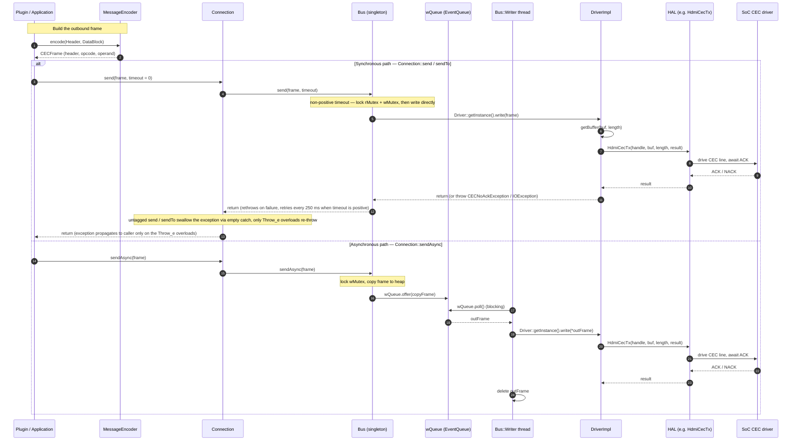
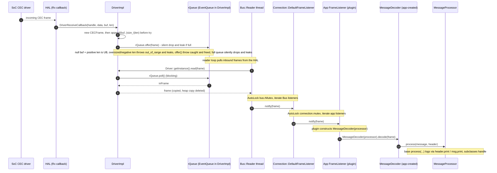
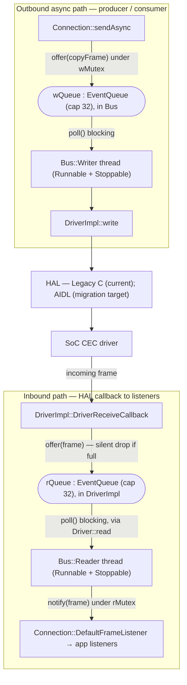

# hdmicec Data Flow & Concurrency

This document traces a CEC message end-to-end through the `hdmicec` (CCEC) middleware — **outbound** (host → HAL → SoC) and **inbound** (SoC → HAL → application) — and explains the `Bus` **producer/consumer** concurrency model that carries those messages. Everything here is anchored on the real `Driver` / `DriverImpl` seam and the actual member names found in the code; the flow *above* the seam is CCEC's responsibility, and the flow *below* it is delegated by `DriverImpl` to the platform HAL. In the current implementation that backend is exclusively the **Legacy C HAL** (`DriverImpl` calls only the `HdmiCec*` C API); the **AIDL/Binder HAL** is the migration target, not a second run-time-selectable backend (see [HAL Interaction](hal-interaction.md)).

The transport is deliberately asymmetric. Outbound frames have **two distinct paths** — a *synchronous* path that calls the HAL directly and an *asynchronous* path that queues the frame for a background writer thread — while inbound frames always arrive asynchronously through a HAL callback and are drained by a background reader thread. The sections below document each path exactly as implemented.

## Related documents

- [Architecture Overview](overview.md) — stack placement and the component/class relationships that this document animates.
- [HAL Interaction](hal-interaction.md) — how CCEC talks to the HAL below the `Driver` seam: the **Legacy C HAL** (the current backend) and the **AIDL/Binder HAL** (the migration target).

---

## 1. Outbound Transmit

Outbound traffic starts with a high-level message being **encoded** into a raw `CECFrame`, and then leaves the middleware through one of two paths depending on which `Connection` API the caller invokes.

### 1.1 Building the frame

Before anything is sent, the application turns a high-level message into wire bytes with `MessageEncoder`, which exposes <b>four static `encode(...)` overloads</b> in two families. The two **header-taking** overloads (`encode(const Header&, const DataBlock&, CECFrame&)` and `encode(const Header&, const DataBlock&)`) serialise in the order **header → opcode → operand**: the header first (`h.serialize(out)`), then the opcode (`OpCode(m.opCode()).serialize(out)`), then the operands (`m.serialize(out)`). The two **data-block-only** overloads (`encode(const DataBlock&, CECFrame&)` and `encode(const DataBlock&)`) emit only **opcode → operand** with **no header**. `Source: hdmicec/ccec/include/ccec/MessageEncoder.hpp`.

<b>`POLLING` is a special case.</b> The `POLLING` opcode (value `0x200`) is a **middleware-internal sentinel** used for CEC bus-presence pings, **not** a wire opcode: `OpCode::serialize` appends the opcode byte **only when** `opCode_ != POLLING`, so a `POLLING` data block serialises to a frame that carries **no opcode byte** (and no operand). Every other opcode is serialised normally. `Source: hdmicec/ccec/include/ccec/OpCode.hpp`.

The resulting `CECFrame` is a fixed-capacity byte buffer — `enum { MAX_LENGTH = 128 }` backing `uint8_t buf_[MAX_LENGTH]` with a `size_t len_` length. `Source: hdmicec/ccec/include/ccec/CECFrame.hpp`.

### 1.2 Synchronous path (`Connection::send` / `sendTo`)

`Connection::send()` / `Connection::sendTo()` forward the frame to the singleton transport as `Bus::send(frame, timeout)`; `Connection` holds a reference to the `Bus` (`Bus &bus`). `Source: hdmicec/ccec/include/ccec/Connection.hpp`.

> **Exception handling differs by overload.** The **untagged** `Connection::send(frame, timeout)` / `sendTo(to, frame, timeout)` overloads wrap the `Bus::send` call in `try { ... } catch (Exception &) {}` with an **empty catch body**, so any CCEC transmit exception (for example `CECNoAckException` or `IOException`) is **suppressed** and never reaches the caller. Only the <b>`Throw_e`-tagged</b> overloads (`send(frame, timeout, Throw_e)` / `sendTo(to, frame, timeout, Throw_e)`) re-throw, propagating the exception to the caller. `Source: hdmicec/ccec/src/Connection.cpp`.

The behaviour of `Bus::send` (which both overload families call) then branches on `timeout`:

- <b>When `timeout <= 0`</b> (the default; `send` declares `int timeout = 0`), `Bus::send` takes **both** locks (`AutoLock rlock_(rMutex), wlock_(wMutex)`), verifies the bus is `started`, and calls `Driver::getInstance().write(frame)` **directly** — the frame is *not* placed on any queue. If the HAL write throws, `Bus::send` rethrows to `Connection`, which then suppresses or propagates it according to the overload the caller chose (see the note above). `Source: hdmicec/ccec/src/Bus.cpp`, `hdmicec/ccec/src/Bus.hpp`.
- <b>When `timeout > 0`</b>, `Bus::send` retries the synchronous write in 250&nbsp;ms increments until the budget is exhausted. It computes `int retry = (timeout / 250)` and loops: `usleep(1000)`, attempt `send(frame, 0)` (the direct branch above), and on failure `usleep(250000)` (250&nbsp;ms) before the next attempt, continuing `while (retry--)`. If the final attempt still fails, the exception is rethrown. `Source: hdmicec/ccec/src/Bus.cpp`.

The exact retry arithmetic (document-as-is):

```text
int retry = (timeout / 250);   // number of attempts derived from the timeout budget
do {
    usleep(1000);              // 1 ms settle before each attempt
    try { send(frame, 0); retry = 0; }   // delegate to the direct (timeout <= 0) branch
    catch (Exception &e) { if (retry == 0) throw; }
    if (retry) usleep(250000); // 250 ms back-off between attempts
} while (retry--);
```

`Source: hdmicec/ccec/src/Bus.cpp`.

### 1.3 Asynchronous path (`Connection::sendAsync`)

`Connection::sendAsync()` forwards to `Bus::sendAsync(frame)`. `Source: hdmicec/ccec/include/ccec/Connection.hpp`. Under `AutoLock lock_(wMutex)`, `Bus::sendAsync` verifies the bus is `started`, **copies the frame onto the heap** (`CECFrame *copyFrame = new CECFrame(); *copyFrame = frame;`), and enqueues the copy with `wQueue.offer(copyFrame)`. `Source: hdmicec/ccec/src/Bus.cpp`.

> **Silent drop and leak at capacity (document-as-is).** `EventQueue::offer` **never throws** when the queue is full: at capacity (default 32) it simply **discards** the element with no signal and no error. `Bus::sendAsync` guards the enqueue with a `try/catch` that deletes the copy only *if `offer` throws* — but because a full-queue drop does **not** throw, that cleanup path never runs. When `wQueue` is saturated the heap-allocated `copyFrame` is therefore **neither enqueued nor freed**: the frame is silently **lost** and its memory is **leaked**. `Source: hdmicec/ccec/src/Bus.cpp`, `hdmicec/osal/include/osal/EventQueue.hpp`.

The background `Bus::Writer` thread later drains the queue: it calls `bus.wQueue.poll()` (blocking), and for each non-null `outFrame` calls `Driver::getInstance().write(*outFrame)` before `delete`-ing it. `Source: hdmicec/ccec/src/Bus.cpp`.

### 1.4 The concrete HAL leg (`DriverImpl::write`)

Both paths converge on the same HAL call. `DriverImpl::write()` serialises the frame's bytes out with `frame.getBuffer(&buf, &length)` and, under its own `AutoLock lock_(mutex)`, hands them to the HAL — on the Legacy C HAL path this is `HdmiCecTx(nativeHandle, buf, length, &sendResult)`. A directed frame that is sent but not acknowledged raises `CECNoAckException`; a hard error raises `IOException`. `Source: hdmicec/ccec/src/DriverImpl.cpp`. (The `Driver` abstraction and the HAL backend behind it — the Legacy C HAL today, with the AIDL/Binder HAL as the migration target — are detailed in [HAL Interaction](hal-interaction.md).)

**Diagram 1 — Outbound transmit (synchronous vs. asynchronous).**



---

## 2. Inbound Receive

Reception is **push-driven** from the SoC upward and is delivered to the application through the observer (`FrameListener`) contract. The chain, documented as-is, is:

1. **HAL callback.** The SoC driver, via the HAL, invokes the registered receive callback `DriverImpl::DriverReceiveCallback(int handle, void *callbackData, unsigned char *buf, int len)`. The callback allocates a fresh `CECFrame` (`new CECFrame()`) and appends the raw bytes into it (`frame->append((unsigned char *)buf, (size_t)len)`) **before** entering a `try` block, then `offer()`s the frame onto the incoming queue `rQueue` — an `EventQueue<CECFrame *>` that lives <b>inside `DriverImpl`</b> (reached through `getIncomingQueue(handle)`) — from within `try { ... } catch (...) { delete frame; }`. `Source: hdmicec/ccec/src/DriverImpl.cpp`, `hdmicec/ccec/src/DriverImpl.hpp`.

   > **Receive-callback trust boundary (document-as-is).** The callback trusts the HAL's arguments — `buf` is assumed **non-null** and `len` a valid frame length in <b>0 … `CECFrame::MAX_LENGTH` (128)</b> — and because `frame->append(buf, (size_t)len)` runs **before** the `try`, its failure modes are distinct and must not be conflated:
   >
   > - <b>Null `buf` with positive `len` → undefined behaviour, not an exception.</b> `CECFrame::append` reads `buf[0]` on its first iteration (the length check passes while `len_ == 0`), so a null `buf` is a **null-pointer dereference (UB / likely crash)** that raises no catchable exception — neither the pre-`try` code nor the `catch (...)` can intercept it.
   > - <b>Oversized or negative `len` → pre-`try` `std::out_of_range`, frame leaked.</b> A `len` above `MAX_LENGTH` (or a **negative** `len` widened by the `(size_t)` cast) makes `append` throw `std::out_of_range` ("Frame grows beyond maximum") **before** the `try`, so the just-allocated `frame` **leaks** and the exception **escapes upward across the C HAL callback boundary**.
   > - <b>`offer()` itself throws → caught, frame freed.</b> The enqueue is `try { rQueue.offer(frame); } catch (...) { delete frame; }`, so an exception raised *by `offer()`* (for example `std::bad_alloc`) is **caught** and the frame is **deleted** — this path neither escapes nor leaks.
   > - **Full queue → silent discard and leak.** As on the outbound side (§1.3), `EventQueue::offer` **never throws** when `rQueue` is full — at capacity (default 32) it **silently discards** the frame. The `catch (...) { delete frame; }` guard runs only if `offer` *throws*, which a full-queue drop does not, so a saturated `rQueue` <b>loses the inbound frame and leaks its `CECFrame`</b>. `Source: hdmicec/ccec/src/DriverImpl.cpp`, `hdmicec/ccec/include/ccec/CECFrame.hpp`, `hdmicec/ccec/src/CECFrame.cpp`, `hdmicec/osal/include/osal/EventQueue.hpp`.
2. **Reader drains the HAL.** The background `Bus::Reader` thread loops while running, calling `Driver::getInstance().read(frame)`. `DriverImpl::read()` drains `rQueue` via a blocking `rQueue.poll()`, copies the dequeued frame into the caller's `CECFrame`, and deletes the heap copy. `Source: hdmicec/ccec/src/Bus.cpp`, `hdmicec/ccec/src/DriverImpl.cpp`.
3. **Fan-out through the Bus.** Still inside the reader loop, under `AutoLock lock_(bus.rMutex)`, `Bus::Reader` iterates its registered `listeners` and calls `(*list_it)->notify(frame)` on each. The listener the `Connection` registered with the `Bus` (in `Connection::open()`) is the `Connection`'s **private** `DefaultFrameListener`, so this call lands back inside `Connection`. `Source: hdmicec/ccec/src/Bus.cpp`, `hdmicec/ccec/src/Connection.cpp`.
4. **Fan-out through the Connection.** `Connection`'s `DefaultFrameListener::notify(const CECFrame &)` re-fans-out — under the `Connection`'s own `AutoLock lock_(connection.mutex)` — to every **application** `FrameListener` registered through `Connection::addFrameListener(...)`. `Connection` itself does **not** decode: it only forwards the frame to the application listeners. `Source: hdmicec/ccec/src/Connection.cpp`, `hdmicec/ccec/include/ccec/FrameListener.hpp`.
5. **Decode and dispatch (application-owned).** Decoding happens in the **application's** `FrameListener::notify(const CECFrame &in)`: the plugin constructs a `MessageDecoder` bound to its own `MessageProcessor` and calls `MessageDecoder(processor).decode(in)` — for example `entservices-hdmicecsink/plugin/HdmiCecSinkImplementation.cpp:127` (the listener's `notify`) → `:148` (the `decode` call), and `entservices-hdmicecsource/plugin/HdmiCecSourceImplementation.cpp:97` → `:108`. `MessageDecoder::decode` converts the raw bytes back into a high-level message and dispatches it through the overloaded `MessageProcessor::process(...)` handlers. Applications **subclass** `MessageProcessor` to react to the messages they care about; the **base** `MessageProcessor::process(...)` overloads are **not** empty and do **not** discard — they **log** the message (calling `header.print()` / `msg.print()`) and take no further protocol action. `Source: hdmicec/ccec/include/ccec/MessageDecoder.hpp`, `hdmicec/ccec/include/ccec/MessageProcessor.hpp`, `entservices-hdmicecsink/plugin/HdmiCecSinkImplementation.cpp`, `entservices-hdmicecsource/plugin/HdmiCecSourceImplementation.cpp`.

> **Listener-callback execution context (document-as-is).** The entire fan-out in steps 3–5 runs <b>synchronously on the `Bus::Reader` thread</b>, while that thread holds `bus.rMutex` (and then, inside `Connection`, `connection.mutex`). Application `FrameListener`s therefore run **on the reader thread under those locks**: a listener that **blocks** stalls all inbound reception; a listener that calls back into `Connection`/`Bus` risks **re-entrant** locking; and — the **outer** `Bus::Reader::run()` loop wraps the whole read-and-dispatch body in a single `try { ... } catch (InvalidStateException &)`, so only that one exception type is absorbed there — an `InvalidStateException` thrown by a listener is **caught** and logged as a benign "EOF for reader" (ending that read iteration), whereas an exception of **any other type propagates out of the reader thread** and terminates it. Listeners are held as **raw, non-owned pointers**, so each registered listener must **outlive** its registration and be unregistered before destruction. Handlers should return **promptly** and avoid throwing: an `InvalidStateException` is absorbed as EOF, but any other exception type tears down the reader thread. `Source: hdmicec/ccec/src/Bus.cpp`, `hdmicec/ccec/src/Connection.cpp`.

**Diagram 2 — Inbound receive (HAL callback to application).**



---

## 3. Bus Producer/Consumer Threading

The `Bus` is the concurrency engine that decouples callers from the (not-thread-safe) HAL. It is a **singleton** — reached through `static Bus & getInstance(void)` — that owns two worker threads via the private inner classes `Bus::Reader` and `Bus::Writer`. Each inner class derives from **both** OSAL `Runnable` **and** OSAL `Stoppable`, and the `Bus` constructor launches them with `Thread(this->reader).start(); Thread(this->writer).start();`. `Source: hdmicec/ccec/src/Bus.hpp`, `hdmicec/ccec/src/Bus.cpp`.

### 3.1 Shared state and roles

The `Bus` holds the following shared state, and its two threads play opposite producer/consumer roles over it:

| Member | Type | Purpose |
|--------|------|---------|
| `listeners` | `std::list<FrameListener *>` | Registered inbound observers, guarded by `rMutex`. |
| `rMutex` | `Mutex` | Guards the listener list during read-side fan-out. |
| `wMutex` | `Mutex` | Guards the outbound enqueue/direct-write critical sections. |
| `wQueue` | `EventQueue<CECFrame *>` | Outbound async queue drained by the `Writer`. |
| `started` | `volatile bool` | Whether the transport is open for send/receive. |

`Source: hdmicec/ccec/src/Bus.hpp`. Note that the **incoming** queue `rQueue` does **not** live in `Bus`; it is an `EventQueue<CECFrame *>` member of `DriverImpl` (`typedef EventQueue<CECFrame *> IncomingQueue`). `Source: hdmicec/ccec/src/DriverImpl.hpp`.

- <b>`Writer` = consumer of `wQueue`.</b> It blocks on `wQueue.poll()`, and for each dequeued frame calls `DriverImpl::write()` (via `Driver::getInstance().write(*outFrame)`), deleting the heap copy afterward. This is the drain side of the asynchronous transmit path in §1.3. `Source: hdmicec/ccec/src/Bus.cpp`.
- <b>`Reader` = producer of listener notifications.</b> It pulls inbound frames from the HAL through `Driver::getInstance().read(frame)` (which blocks on `DriverImpl::rQueue`), then fans each frame out to the registered `FrameListener`s under `rMutex`. This is the read side of the inbound path in §2. `Source: hdmicec/ccec/src/Bus.cpp`.

### 3.2 OSAL underpinnings

The threading model is built entirely on the OSAL primitives:

- <b>`EventQueue<E>`</b> is a template collection (default capacity `EventQueue(size_t cap = 32)`). `offer(E)` appends to the internal `std::deque` and signals waiters (`push_back` + `cond.set()` + `cond.notifyAll()`) **only while there is spare capacity**; once the queue holds `cap` (32) elements, `offer` **silently discards** the element and **never throws** — there is no return value or error to signal the drop, so the caller cannot tell the element was lost (the frame-loss/leak consequence of this is documented in §1.3 and §2). `poll()` **blocks** on `cond.wait()` and returns the front element (resetting the condition when the queue empties); `size()` reports the current depth. It is synchronised internally by an OSAL `Mutex` plus a `ConditionVariable`. `Source: hdmicec/osal/include/osal/EventQueue.hpp`.
- <b>`Thread`</b> derives from `Runnable` and wraps a native thread; constructing a `Thread(Runnable &target)` and calling `start()` runs the target's `run()` in a new thread of execution. `Source: hdmicec/osal/include/osal/Thread.hpp`, `hdmicec/osal/include/osal/Runnable.hpp`.
- <b>`Mutex`</b> is a **recursive** mutual-exclusion lock, paired with the `AutoLock` RAII helper that locks on construction and unlocks on destruction (the `AutoLock rlock_(rMutex), wlock_(wMutex)` idiom seen throughout `Bus`). `Source: hdmicec/osal/include/osal/Mutex.hpp`.
- <b>`ConditionVariable`</b> provides `wait()` / `wait(long timeout)` / `notify()` / `notifyAll()` plus a latched flag via `set()` / `reset()` / `isSet()`; it is the signalling mechanism inside `EventQueue`. `Source: hdmicec/osal/include/osal/ConditionVariable.hpp`.
- <b>`Stoppable`</b> gives each worker its lifecycle state machine (`RUNNING` / `STOPPING` / `STOPPED`) via `stop(bool)`, `isStopped()`, and the protected `runStarted()` / `stopStarted()` / `stopCompleted()` transitions used by `Reader::run` and `Writer::run`. `Source: hdmicec/osal/include/osal/Stoppable.hpp`.

> **Note on frame capacity.** `CECFrame` reserves `MAX_LENGTH = 128` bytes of buffer in code (`uint8_t buf_[MAX_LENGTH]`). `Source: hdmicec/ccec/include/ccec/CECFrame.hpp`. Real CEC messages are far smaller: the AIDL HAL contract states that the maximum message size — header block plus opcode block plus operand blocks — is `16 * 8` bits (16 bytes). `Source: rdk-halif-aidl/hdmicec/current/com/rdk/hal/hdmicec/IHdmiCecController.aidl:95`. The 128-byte buffer is therefore a generous code-level constant, not the protocol's own message-size limit.

**Diagram 3 — Bus producer/consumer threading.** Both queues are OSAL `EventQueue`s synchronised internally by a `Mutex` + `ConditionVariable`; `wMutex` guards the outbound enqueue/write, and `rMutex` guards the inbound listener fan-out.



---

*For where these components sit in the stack and how they relate, see the [Architecture Overview](overview.md); for the HAL backend that `DriverImpl::write` and `DriverReceiveCallback` bridge to — the Legacy C HAL today, with the AIDL/Binder HAL as the migration target — see [HAL Interaction](hal-interaction.md).*
