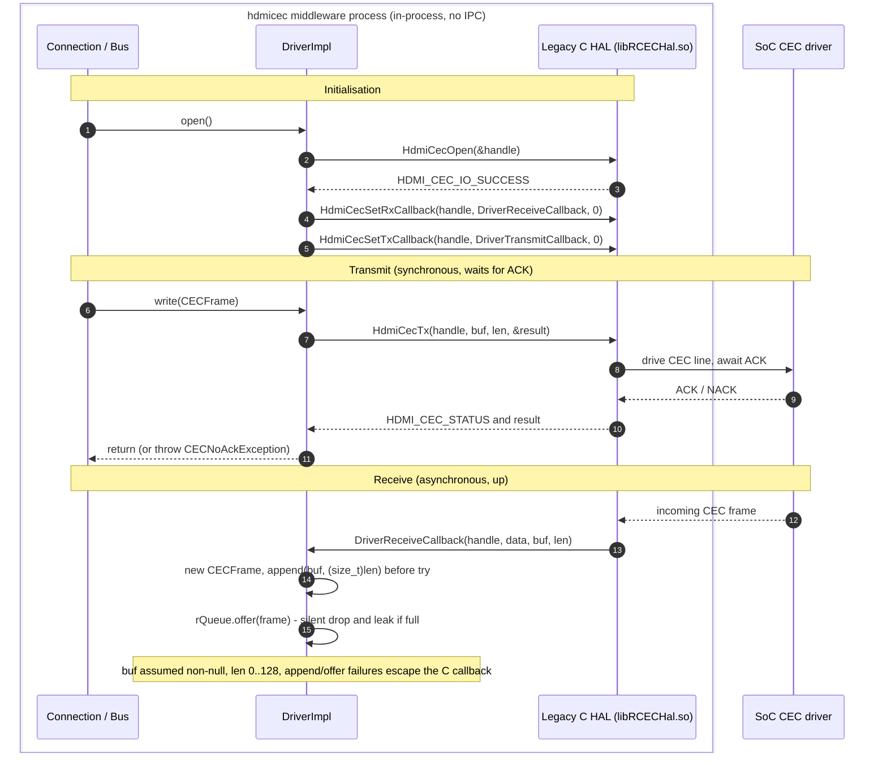
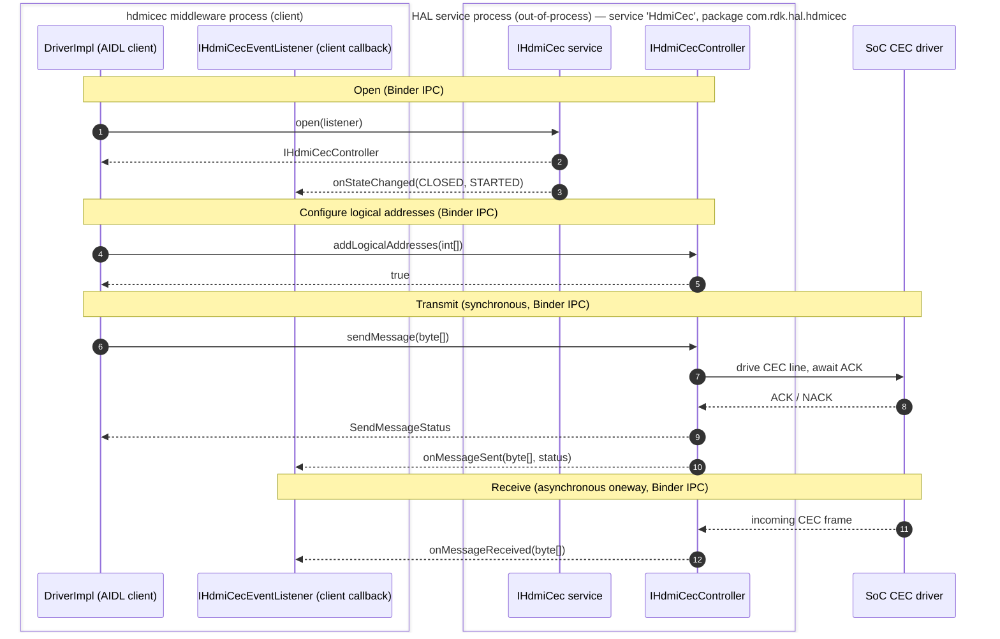

# hdmicec HAL Interaction

This document explains how the `hdmicec` (CCEC) middleware talks to the HDMI-CEC **HAL** beneath it, across the legacy and the target backends. As the HAL **"Caller,"** CCEC never implements the HAL itself; it *consumes* a HAL through a single abstract contract. Two concrete backends are relevant to that contract:

- the **Legacy C HAL** — the **currently implemented** path, an **in-process** vendor C library (`libRCECHal.so`) reached through the C API declared in `hdmi_cec_driver.h`; and
- the **AIDL/Binder HAL** — the **migration target**, an **out-of-process** service reached over **Binder IPC**; its interfaces are declared in the AIDL package `com.rdk.hal.hdmicec`, and the service registers under the name `HdmiCec` (see §3 for the precise package / interface / service-name distinction).

Both paths are anchored on the real `Driver` / `DriverImpl` seam described below, and both are diagrammed here. That the legacy path is the concrete implementation today is verifiable directly in the adapter, which `#include`s the legacy C header: `#include "ccec/drivers/hdmi_cec_driver.h"`. `Source: hdmicec/ccec/src/DriverImpl.cpp`. The AIDL/Binder contract is the modern replacement standardised by `rdk-halif-aidl`; adopting it is **confined to the single adapter class**, but it is **not** a mechanical body-swap — the AIDL contract differs from the legacy C API in lifecycle, status/error reporting, callback model, and address APIs, so the adapter must translate between the two (enumerated in §4). This is the essence of the *Bundle 1: RDK-V — CEC HAL Migration* effort.

## Related documents

- [Architecture Overview](overview.md) — stack placement and the component/class relationships that this document drills into.
- [Data Flow & Concurrency](data-flow.md) — the outbound transmit / inbound receive sequences and the `Bus` producer/consumer threading model that sit *above* the seam described here.
- [Module README](../../README.md) — module overview (purpose, key components, configuration, testing, and limitations).

---

## 1. The HAL Boundary — `Driver` contract and `DriverImpl` adapter

The middleware isolates itself from any specific HAL behind a single **abstract, pure-virtual contract**, `Driver`, and reaches it through a process-wide singleton accessor, `static Driver & getInstance(void)`. `Source: hdmicec/ccec/include/ccec/Driver.hpp`. Everything above the seam (`LibCCEC`, `Connection`, `Bus`) calls only this abstract type; the concrete backend is never named at the call sites. `Source: hdmicec/docs/architecture/overview.md`.

### 1.1 The `Driver` abstract contract (document-as-is)

`Driver` declares the following pure-virtual methods (all `= 0`), which every concrete backend must implement. `Source: hdmicec/ccec/include/ccec/Driver.hpp`.

| Abstract method | Signature | Responsibility |
|-----------------|-----------|----------------|
| `open` | `void open(void)` | Acquire the HAL instance and register callbacks. |
| `close` | `void close(void)` | Release the HAL instance. |
| `read` | `void read(CECFrame &frame)` | Deliver the next received frame to the caller. |
| `write` | `void write(const CECFrame &frame)` | **Synchronous** transmit; waits for the acknowledgement. |
| `writeAsync` | `void writeAsync(const CECFrame &frame)` | Fire-and-forget transmit (deprecated backend variant). |
| `addLogicalAddress` | `bool addLogicalAddress(const LogicalAddress &source)` | Claim a logical address on the bus. |
| `removeLogicalAddress` | `void removeLogicalAddress(const LogicalAddress &source)` | Release a previously claimed logical address. |
| `getLogicalAddress` | `int getLogicalAddress(int devType)` | Query the logical address for a device type. |
| `getPhysicalAddress` | `void getPhysicalAddress(unsigned int *physicalAddress)` | Query the host physical address. |
| `isValidLogicalAddress` | `bool isValidLogicalAddress(const LogicalAddress &source) const` | Test whether an address is currently claimed. |
| `poll` | `void poll(const LogicalAddress &from, const LogicalAddress &to)` | Send a polling message to probe for a device. |
| `printFrameDetails` | `void printFrameDetails(const CECFrame &frame)` | Diagnostic dump of a frame's header/opcode. |

`Driver` also publishes a transmit-status enumeration that captures the three possible outcomes of a directed send — `{ SENT_AND_ACKD, SENT_FAILED = 1, SENT_BUT_NOT_ACKD }` — meaning, respectively, *on the bus and acknowledged by the destination*, *never made it onto the bus*, and *on the bus but not acknowledged by any follower*. `Source: hdmicec/ccec/include/ccec/Driver.hpp`.

### 1.2 The `DriverImpl` concrete adapter (the seam)

`DriverImpl` is the **single concrete subclass** of `Driver` (`class DriverImpl : public Driver`) and is therefore the exact point where the abstract contract meets a real HAL. `Source: hdmicec/ccec/src/DriverImpl.hpp`. It maps each abstract method to a concrete HAL call and adds the machinery needed to bridge the HAL's callback-driven receive model to the middleware's queue-based one:

- an **incoming receive queue** — `typedef EventQueue<CECFrame *> IncomingQueue;` with the member `rQueue` — into which received frames are buffered for the reader side to drain. `Source: hdmicec/ccec/src/DriverImpl.hpp`.
- a **lifecycle status** enum `{ CLOSED = 0, CLOSING, OPENED }` tracked by the `status` member, plus a `nativeHandle` for the opened HAL instance and a `std::list<LogicalAddress> logicalAddresses` of claimed addresses. `Source: hdmicec/ccec/src/DriverImpl.hpp`.
- two **static HAL callbacks** with C-compatible signatures that the backend can invoke: `DriverReceiveCallback(int handle, void *callbackData, unsigned char *buf, int len)` for inbound frames and `DriverTransmitCallback(int handle, void *callbackData, int result)` for transmit-result notifications. `Source: hdmicec/ccec/src/DriverImpl.hpp`.

Most of `DriverImpl`'s HAL-facing methods take an OSAL mutex (`AutoLock lock_(mutex)`) at entry — `open`, `close`, `write`, `writeAsync`, `addLogicalAddress`, `removeLogicalAddress`, `getLogicalAddress`, `getPhysicalAddress`, and `isValidLogicalAddress` — so concurrent calls through the adapter are serialised while that mutex is held. This matters because the legacy C HAL is explicitly *not* thread-safe (see §2). Three qualifications apply, however, and are visible in the source: (1) `read()` takes the mutex only to check state, then **releases it before blocking** on `rQueue.poll()`; (2) the static callbacks `DriverReceiveCallback` / `DriverTransmitCallback`, the accessor `getIncomingQueue()`, and `printFrameDetails()` do **not** take the adapter mutex (`poll()` acquires no mutex of its own, but reaches the HAL by delegating to the locked `write()`); and (3) the adapter's callers are not only the `Bus` threads — `LibCCEC` invokes `open`/`close`/`addLogicalAddress`/`getLogicalAddress`/`getPhysicalAddress`, and `Connection` invokes `isValidLogicalAddress`, directly via `Driver::getInstance()`. `Source: hdmicec/ccec/src/DriverImpl.cpp`, `hdmicec/ccec/src/LibCCEC.cpp`, `hdmicec/ccec/src/Connection.cpp`.

Because the middleware depends only on `Driver`, adopting a different HAL beneath the seam is localised to `DriverImpl`; nothing above it is aware of the change (though, as §4 details, that change is a genuine re-implementation of the adapter, not merely re-pointing calls). The remainder of this document walks the two backends relevant to that seam: the **Legacy C HAL** that `DriverImpl` bridges to **today** (its single, currently-compiled backend), and the **AIDL/Binder HAL** it is being **migrated toward** — the target backend, not a second backend `DriverImpl` bridges to concurrently.

---

## 2. Legacy C HAL Path (currently implemented)

On the legacy path, `DriverImpl` binds **in-process** to the vendor C library (`libRCECHal.so`) through the C API declared in `hdmi_cec_driver.h`. `Source: hdmicec/ccec/src/DriverImpl.cpp`, `rdk-halif-hdmi_cec/include/hdmi_cec_driver.h`. Every call is an ordinary in-process C function call — there is **no IPC and no process boundary**. This is the backend compiled today, confirmed by the adapter's `#include "ccec/drivers/hdmi_cec_driver.h"`. `Source: hdmicec/ccec/src/DriverImpl.cpp`.

### 2.1 Method mapping (abstract → concrete C call)

`DriverImpl` implements each abstract `Driver` method; most translate directly into a legacy C function, while a few are serviced locally — from the incoming queue or the adapter's own state — and make no HAL call. All mappings below are verified against the adapter implementation. `Source: hdmicec/ccec/src/DriverImpl.cpp`, `rdk-halif-hdmi_cec/include/hdmi_cec_driver.h`.

| `Driver` method | Legacy C HAL call(s) | Notes |
|-----------------|----------------------|-------|
| `open()` | `HdmiCecOpen(&nativeHandle)`, then `HdmiCecSetRxCallback(nativeHandle, DriverReceiveCallback, 0)` and `HdmiCecSetTxCallback(nativeHandle, DriverTransmitCallback, 0)` | Opens the instance and registers the receive/transmit callbacks. **Only `HdmiCecOpen`'s return is checked** (`throw IOException()` if it is not `HDMI_CEC_IO_SUCCESS`); the return values of `HdmiCecSetRxCallback` and `HdmiCecSetTxCallback` are **ignored**, so a callback-registration failure is not surfaced. On success `status` becomes `OPENED`. Re-opening while already open is a **silent no-op** (the `InvalidStateException` throw is compiled out under `#if 0`). |
| `close()` | `HdmiCecClose(nativeHandle)` | Offers a `NULL` sentinel to `rQueue` first to unblock the reader, then closes. |
| `write()` | `HdmiCecTx(nativeHandle, buf, length, &sendResult)` | **Synchronous** — writes a complete frame and waits for ACK. A hard error raises `IOException`. Two distinct NACK paths raise `CECNoAckException` on `HDMI_CEC_IO_SENT_BUT_NOT_ACKD`: (a) a **directed** message (`(frame.at(0) & 0x0F) != 0x0F`); and (b) a **broadcast** `REPORT_PHYSICAL_ADDRESS` message (`(frame.at(0) & 0x0F) == 0x0F` with opcode `REPORT_PHYSICAL_ADDRESS`), the latter to satisfy CEC CTS 9-3-3. |
| `writeAsync()` | `HdmiCecTxAsync(nativeHandle, buf, length)` | The **deprecated** fire-and-forget variant. |
| `addLogicalAddress()` | `HdmiCecAddLogicalAddress(nativeHandle, source.toInt())` | Throws `InvalidStateException` if not `OPENED`. Maps only **two** HAL codes: `HDMI_CEC_IO_LOGICALADDRESS_UNAVAILABLE` → `AddressNotAvailableException`, and `HDMI_CEC_IO_GENERAL_ERROR` → `IOException`. **Every other non-success code is treated as success** — the address is recorded in the local `logicalAddresses` list and the method returns `true` regardless — so other HAL failures are not surfaced. |
| `removeLogicalAddress()` | `HdmiCecRemoveLogicalAddress(nativeHandle, source.toInt())` | Also removes the address from the local `logicalAddresses` list. |
| `getLogicalAddress()` | `HdmiCecGetLogicalAddress(nativeHandle, &logicalAddress)` | Returns the logical address reported by the HAL. The **`HdmiCecGetLogicalAddress` return status is ignored**; the local out value is initialised to `0` and returned as-is, so if the HAL does not populate it the caller silently receives `0`. Although the `Driver` signature takes a `devType`, the current implementation **ignores it** (it is only logged) and does not pass it to `HdmiCecGetLogicalAddress()`. |
| `getPhysicalAddress()` | `HdmiCecGetPhysicalAddress(nativeHandle, physicalAddress)` | Passes the **caller-provided out-pointer straight to the HAL**; the **return status is ignored** and the pointer is then **dereferenced without a null check** (`*physicalAddress` is read in the trailing debug log), so a null argument is unsafe. |
| `read()` | *(none — local incoming queue)* | Drains the next frame from the incoming `rQueue`; takes the mutex only for the state check and releases it before blocking on `rQueue.poll()`. Makes no HAL call. |
| `isValidLogicalAddress()` | *(none — local state)* | Returns whether `source` is present in the adapter's local `logicalAddresses` list. Makes no HAL call. |
| `poll()` | `HdmiCecTx(...)` via `write()` | Builds a one-byte frame from the `from`/`to` nibbles and calls `write()`, so it reaches the HAL through `HdmiCecTx()` rather than a dedicated poll function. |
| `printFrameDetails()` | *(none — diagnostic)* | Formats and logs the frame's bytes and opcode/header for debugging. Makes no HAL call. |

The C library also declares the two callback function-pointer types the adapter registers: `HdmiCecRxCallback_t(int handle, void *callbackData, unsigned char *buf, int len)` for received frames and the **deprecated** `HdmiCecTxCallback_t(int handle, void *callbackData, int result)` for async transmit results. `Source: rdk-halif-hdmi_cec/include/hdmi_cec_driver.h`.

### 2.2 Receive path (asynchronous, up)

Reception is push-driven from the bottom up: the SoC driver, via the legacy HAL, invokes the registered `HdmiCecRxCallback_t` — which is `DriverImpl::DriverReceiveCallback(int handle, void *callbackData, unsigned char *buf, int len)`. That callback allocates a fresh `CECFrame`, appends the raw bytes into it (`frame->append((unsigned char *)buf, (size_t)len)`) **before** entering a `try`, then `offer()`s the frame onto the incoming `rQueue` from within `try { ... } catch (...) { delete frame; }`, from which the middleware's reader side drains it. `Source: hdmicec/ccec/src/DriverImpl.cpp`.

> **Receive-callback trust boundary (document-as-is).** The callback trusts the HAL's arguments: `buf` is assumed **non-null** and `len` a valid length in **0 … `CECFrame::MAX_LENGTH` (128)**. Because the `append` runs **before** the `try`, a bad argument is *not* caught here — `CECFrame::append` throws `std::out_of_range` ("Frame grows beyond maximum") when the count exceeds `MAX_LENGTH`, and a **negative** `len` becomes a huge value under the `(size_t)` cast and triggers the same throw — so the just-allocated `frame` leaks and the exception escapes across the C HAL callback boundary. And because `EventQueue::offer` **never throws** on a full queue (it silently discards at capacity 32), the `catch`-based `delete` never runs for a full-queue drop, so a saturated `rQueue` **loses the frame and leaks its `CECFrame`**. `Source: hdmicec/ccec/src/DriverImpl.cpp`, `hdmicec/ccec/include/ccec/CECFrame.hpp`, `hdmicec/osal/include/osal/EventQueue.hpp`.

### 2.3 Contract properties

Two properties of the legacy C contract shape the middleware's design:

- **Synchronous transmit.** `HdmiCecTx()` is documented as a *"Synchronous transmit call"* that *"writes a complete CEC message onto the bus and waits for ACK."* `Source: rdk-halif-hdmi_cec/include/hdmi_cec_driver.h`.
- **Not thread-safe.** The C HAL functions are repeatedly annotated *"This API is NOT thread safe."* `Source: rdk-halif-hdmi_cec/include/hdmi_cec_driver.h`. The middleware's principal defence is the OSAL mutex taken inside `DriverImpl`'s HAL-facing methods (enumerated in §1.2), which serialises the calls that acquire it. Note that not every entry point locks and that callers include `LibCCEC` and `Connection` directly — not only the `Bus` threads. `Source: hdmicec/ccec/src/DriverImpl.cpp`.

**Diagram 1 — Legacy C HAL interaction (in-process, no IPC).** All of `Connection`/`Bus`, `DriverImpl`, and the Legacy C HAL live in the same process; only the SoC silicon sits below them.

Every arrow above is an in-process function call. The asynchronous element is the receive callback: when the HAL invokes the registered `DriverReceiveCallback`, the adapter copies the raw bytes into a freshly allocated `CECFrame` and enqueues it on `rQueue` via `offer()`. The HAL contract does **not** specify which thread runs the callback, and `EventQueue::offer()` acquires the queue's own mutex, so whether the enqueue can block is likewise unspecified — the callback's execution context and blocking behaviour should be treated as undefined by the contract. As detailed in the §2.2 trust-boundary note, the `append(buf, (size_t)len)` also runs **before** the callback's `try`, so a null `buf` or an out-of-range `len` (including a negative value widened by the `(size_t)` cast) throws out of the C callback and leaks the frame. `Source: hdmicec/ccec/src/DriverImpl.cpp`.

---

## 3. AIDL/Binder HAL Path (migration target)

The modern contract standardises the HAL over **AIDL/Binder IPC** to an **out-of-process** service. Three identifiers must be kept distinct: the **AIDL package** (namespace) `com.rdk.hal.hdmicec`, in which the interfaces are declared; the **interface** `IHdmiCec` (fully qualified `com.rdk.hal.hdmicec.IHdmiCec`); and the **service registration name** `HdmiCec`, the value of the `IHdmiCec.serviceName` string constant, under which the service registers with — and is looked up from — the Service Manager. The package name is therefore *not* the service name. `Source: rdk-halif-aidl/hdmicec/current/com/rdk/hal/hdmicec/IHdmiCec.aidl`. In this model, `DriverImpl` (or its AIDL successor) is the **Binder client**, and every call below crosses the **process boundary** — the defining contrast with the in-process legacy path in §2. All three interfaces are declared `@VintfStability`. `Source: rdk-halif-aidl/hdmicec/current/com/rdk/hal/hdmicec/IHdmiCec.aidl`.

### 3.1 `IHdmiCec` — the service / session interface

`IHdmiCec` is the top-level service used to acquire and release a control session, and to query state. `Source: rdk-halif-aidl/hdmicec/current/com/rdk/hal/hdmicec/IHdmiCec.aidl`.

- `State getState()` — returns the current interface state.
- `@nullable PropertyValue getProperty(in Property property)` — reads a property (null if the key is unknown).
- `int[] getLogicalAddresses()` — the logical addresses currently set for filtering (the broadcast address `0xF` is always implied and not returned).
- `@nullable IHdmiCecController open(in IHdmiCecEventListener cecControllerListener)` — opens the interface for control, returning the control-plane handle. **Only a single instance may open**; success transitions the interface directly to `STARTED`, and if the owning client crashes, `close()` is called implicitly for cleanup.
- `boolean close(in IHdmiCecController hdmiCecController)` — closes the session; on return no further listener callbacks occur and all added logical addresses are removed.
- `boolean registerEventListener(in IHdmiCecEventListener cecEventListener)` / `boolean unregisterEventListener(in IHdmiCecEventListener cecEventListener)` — attach/detach an additional (diagnostic) listener.

### 3.2 `IHdmiCecController` — the control plane

`open()` returns an `IHdmiCecController`, the control plane over which addresses are managed and frames are transmitted. `Source: rdk-halif-aidl/hdmicec/current/com/rdk/hal/hdmicec/IHdmiCecController.aidl`.

- `boolean addLogicalAddresses(in int[] logicalAddresses)` — adds one or more logical addresses (each in the directly addressable range `0x0`–`0xE`) for message filtering and ACK.
- `boolean removeLogicalAddresses(in int[] logicalAddresses)` — removes previously added logical addresses.
- `SendMessageStatus sendMessage(in byte[] message)` — **synchronously** writes a complete CEC frame onto the bus and waits for an ACK, returning a `SendMessageStatus`.

### 3.3 `IHdmiCecEventListener` — asynchronous callbacks

The client supplies an `IHdmiCecEventListener` (declared `oneway`, so its callbacks are fire-and-forget deliveries back over Binder into the client process). `Source: rdk-halif-aidl/hdmicec/current/com/rdk/hal/hdmicec/IHdmiCecEventListener.aidl`.

- `void onMessageReceived(in byte[] message)` — a received frame (directed or broadcast).
- `void onStateChanged(in State oldState, in State newState)` — a state transition.
- `void onMessageSent(in byte[] message, SendMessageStatus status)` — the result of a transmitted frame, primarily for diagnostic watchers.

### 3.4 Supporting enumerations

- `State { CLOSED = 0, STARTED = 1 }`. `Source: rdk-halif-aidl/hdmicec/current/com/rdk/hal/hdmicec/State.aidl`.
- `SendMessageStatus { ACK_STATE_0 = 0, ACK_STATE_1 = 1, BUSY = 2 }` — the ACK/arbitration outcome of a send (`BUSY` means CEC line arbitration failed after two attempts and the message was not sent). `Source: rdk-halif-aidl/hdmicec/current/com/rdk/hal/hdmicec/SendMessageStatus.aidl`.
- `Property { HAL_CEC_VERSION = 0, METRIC_DIRECTED_MESSAGES_SENT = 1000, METRIC_BROADCAST_MESSAGES_SENT = 1001, METRIC_DIRECTED_MESSAGES_SENT_AND_ACKED = 1002, METRIC_BROADCAST_MESSAGE_SENT_AND_ACKED = 1003, METRIC_ARBITRATION_FAILURES = 1004 }`. `Source: rdk-halif-aidl/hdmicec/current/com/rdk/hal/hdmicec/Property.aidl`.

> **Note on message size.** `sendMessage()` documents the maximum frame — header block plus opcode block plus operand blocks — as `16 * 8` bits (16 bytes). `Source: rdk-halif-aidl/hdmicec/current/com/rdk/hal/hdmicec/IHdmiCecController.aidl:95`. This is distinct from the middleware's fixed frame *buffer* capacity, `CECFrame`'s `MAX_LENGTH = 128`, which is a generous code-level constant rather than the protocol's own message-size limit. `Source: hdmicec/ccec/include/ccec/CECFrame.hpp`.

**Diagram 2 — AIDL/Binder HAL interaction (out-of-process, over Binder IPC).** The middleware client and the HAL service run in **separate processes**; every arrow between them is a Binder IPC call, including the `oneway` listener callbacks that travel back into the client process.

Contrast with Diagram 1: here the `DI ⇄ SVC/CTRL` arrows and the `SVC/CTRL → LSN` callbacks all cross the process boundary via Binder, whereas the legacy path is entirely in-process. The synchronous nature of transmit is preserved (`sendMessage()` blocks until the HAL reports a `SendMessageStatus`), but delivery of received frames now arrives as a `oneway` `onMessageReceived()` callback rather than a C function-pointer invocation.

---

## 4. The Migration Seam and Required Adaptations

Because the middleware depends **only** on the abstract `Driver` contract — never on a concrete HAL — adopting a different backend is localised entirely to `DriverImpl`, the single adapter, while `LibCCEC`, `Connection`, `Bus`, and the message pipeline stay untouched. `Source: hdmicec/ccec/include/ccec/Driver.hpp`, `hdmicec/ccec/src/DriverImpl.hpp`. This localisation is what makes the *Bundle 1: RDK-V — CEC HAL Migration* effort tractable.

That localisation, however, is **not** the same as a mechanical body-swap. The AIDL/Binder contract (§3) is presented here as the **target adapter** — the interface a future `DriverImpl` must satisfy — and it differs from the legacy C API (§2) in several ways the adapter must reconcile in order to keep honouring the existing `Driver` contract (§1.1). The concrete adaptations are:

| `Driver` contract expectation (§1.1) | Legacy C HAL (§2) | AIDL/Binder HAL (§3) | Adaptation the adapter must perform |
|---|---|---|---|
| **Lifecycle** — `open(void)` / `close(void)` | `HdmiCecOpen(&handle)` / `HdmiCecClose(handle)`; a bare integer handle, no session object | `IHdmiCec.open(listener)` returns an `IHdmiCecController` session; `close(controller)`; explicit `State { CLOSED, STARTED }`; single-open constraint; implicit `close()` on client crash | Hold and drive the returned `IHdmiCecController`, track the `State` model, and observe/enforce the single-open rule instead of a bare handle. |
| **Transmit status** | `sendResult` codes such as `HDMI_CEC_IO_SENT_AND_ACKD` / `HDMI_CEC_IO_SENT_BUT_NOT_ACKD` / `HDMI_CEC_IO_SENT_FAILED` | `SendMessageStatus { ACK_STATE_0, ACK_STATE_1, BUSY }` returned from `sendMessage()` | Map `SendMessageStatus` onto the `Driver` transmit-status semantics and onto the existing `CECNoAckException` / `IOException` decisions. |
| **Error reporting** | integer return codes inspected inline; adapter throws `CECNoAckException` / `IOException` / `AddressNotAvailableException` | Binder status / service-specific exceptions (`EX_SERVICE_SPECIFIC`, `EX_ILLEGAL_ARGUMENT`, …) | Translate Binder exceptions into the same C++ exception types the middleware already catches. |
| **Receive/transmit callbacks** | C function pointers `HdmiCecSetRxCallback` / `HdmiCecSetTxCallback` invoking `DriverReceiveCallback` / `DriverTransmitCallback` | `oneway IHdmiCecEventListener` with `onMessageReceived` / `onStateChanged` / `onMessageSent`, delivered over Binder | Implement the listener interface and funnel `onMessageReceived()` into the same `rQueue.offer()` path the legacy callback uses. |
| **Logical addresses** — single `addLogicalAddress` / `removeLogicalAddress` / `getLogicalAddress(devType)` / `isValidLogicalAddress` | one-at-a-time C calls; adapter keeps a local `logicalAddresses` list | batch `addLogicalAddresses(int[])` / `removeLogicalAddresses(int[])` / `getLogicalAddresses()`; **no** per-`devType` query and **no** dedicated `isValidLogicalAddress` | Bridge the single-address calls onto the batch array APIs, and continue servicing `getLogicalAddress`/`isValidLogicalAddress` from local state. |
| **Physical address** — `getPhysicalAddress(unsigned int *)` | `HdmiCecGetPhysicalAddress(handle, out)` | **not provided** by the AIDL HDMI-CEC interfaces | Source the physical address elsewhere (e.g. host / device-settings), since the AIDL contract exposes no equivalent. |
| **Async transmit** — `writeAsync` | `HdmiCecTxAsync()` (deprecated) | **no** asynchronous send — only synchronous `sendMessage()` | Emulate `writeAsync` on top of `sendMessage()`, or treat it as unsupported, as the AIDL contract has no fire-and-forget send. |

Underlying these adaptations, both backends do share the same **responsibility split** between HAL and middleware, which is why the migration is confined to the adapter rather than rippling through the stack. `Source: rdk-halif-aidl/hdmicec/current/docs/hdmi_cec.md`.

| Concern | Owner | Responsibilities |
|---------|-------|------------------|
| **Low-level CEC protocol** | **HAL** (Legacy C or AIDL) | Electrical timing, bus arbitration, frame re-transmission/retries, and ACK sampling, per HDMI-CEC 1.4b. Frames are treated as **opaque** byte buffers. |
| **High-level CEC protocol** | **CCEC middleware** | Device discovery, logical-address allocation, and message semantics — opcode/operand encoding, decoding, and dispatch through the `Message*` pipeline. |

Two further properties are common to both backends and are visible in the diagrams:

- The HAL never parses a frame; the caller must pass a **fully-formed** frame (header block + data blocks). All opcode/operand meaning lives in the middleware. `Source: rdk-halif-aidl/hdmicec/current/docs/hdmi_cec.md`.
- The **principal transmit call is synchronous** on both backends (`HdmiCecTx()` / `sendMessage()`), and the middleware's `Bus` performs the queuing and one-in-flight serialisation above the seam. The "HAL does no queuing" property is asserted **only for these synchronous send paths**: the AIDL contract exposes **only** the synchronous `sendMessage()`, whereas the Legacy C HAL **additionally** declares a **deprecated** fire-and-forget `HdmiCecTxAsync()` whose internal buffering/queuing behaviour the header does not specify — so the no-queuing claim is **not** extended to that deprecated async path. `Source: rdk-halif-hdmi_cec/include/hdmi_cec_driver.h`, `rdk-halif-aidl/hdmicec/current/com/rdk/hal/hdmicec/IHdmiCecController.aidl`.

Beyond the shared split, **transport locality** is only the most visible difference — in-process C calls versus out-of-process Binder IPC with `oneway` callbacks. As the adaptation table above shows, the migration additionally requires the adapter to reconcile lifecycle, status, error, callback, and address-API differences. Everything *above* `DriverImpl` remains insulated from all of these; the adapter absorbs them.

---

*For where this seam sits in the wider module, see the [Architecture Overview](overview.md); for the transmit/receive sequences and the `Bus` threading model above the seam, see [Data Flow & Concurrency](data-flow.md); for module-level context, return to the [Module README](../../README.md).*
