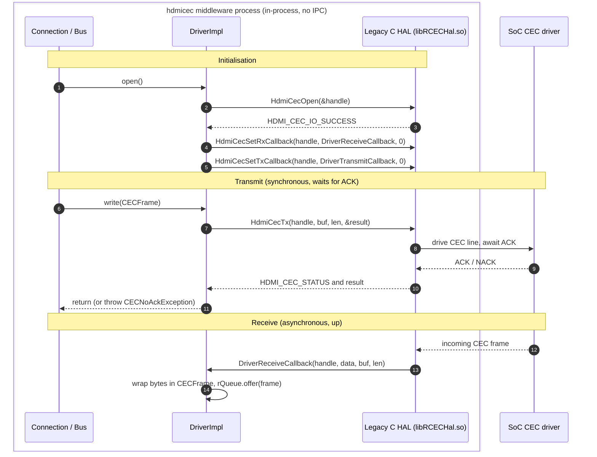
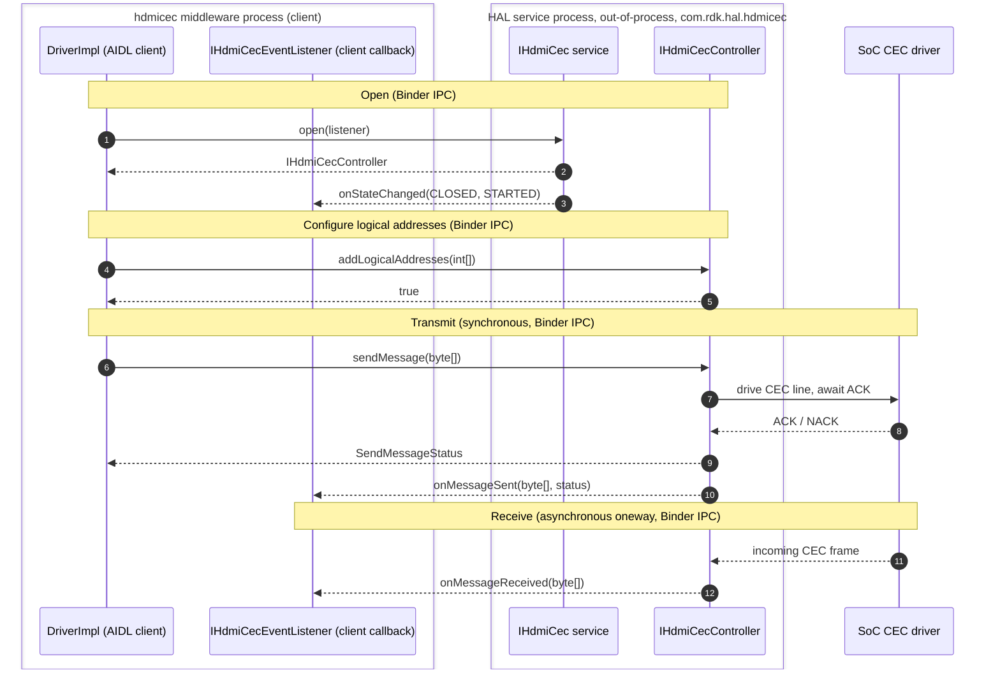

# hdmicec HAL Interaction

This document explains how the `hdmicec` (CCEC) middleware talks to the HDMI-CEC **HAL** beneath it, on **both** supported backends. As the HAL **"Caller,"** CCEC never implements the HAL itself; it *consumes* one of two interchangeable backends through a single abstract contract:

- the **Legacy C HAL** — the **currently implemented** path, an **in-process** vendor C library (`libRCECHal.so`) reached through the C API declared in `hdmi_cec_driver.h`; and
- the **AIDL/Binder HAL** — the **migration target**, an **out-of-process** service (`com.rdk.hal.hdmicec`) reached over **Binder IPC**.

Both paths are anchored on the real `Driver` / `DriverImpl` seam described below, and both are diagrammed here. That the legacy path is the concrete implementation today is verifiable directly in the adapter, which `#include`s the legacy C header: `#include "ccec/drivers/hdmi_cec_driver.h"`. `Source: hdmicec/ccec/src/DriverImpl.cpp`. The AIDL/Binder contract is the modern replacement standardised by `rdk-halif-aidl`, and swapping between the two is confined to the single adapter class — the essence of the *Bundle 1: RDK-V — CEC HAL Migration* effort (see §4).

## Related documents

- [Architecture Overview](overview.md) — stack placement and the component/class relationships that this document drills into.
- [Data Flow & Concurrency](data-flow.md) — the outbound transmit / inbound receive sequences and the `Bus` producer/consumer threading model that sit *above* the seam described here.
- [Module README](../../README.md) — module overview (purpose, key components, configuration, testing, and limitations).

---

## 1. The HAL Boundary — `Driver` contract and `DriverImpl` adapter

The middleware isolates itself from any specific HAL behind a single **abstract, pure-virtual contract**, `Driver`, and reaches it through a process-wide singleton accessor, `static Driver & getInstance(void)`. `Source: hdmicec/ccec/include/ccec/Driver.hpp`. Everything above the seam (`LibCCEC`, `Connection`, `Bus`) calls only this abstract type; the concrete backend is never named at the call sites. `Source: hdmicec/docs/architecture/overview.md`.

### 1.1 The `Driver` abstract contract (document-as-is)

`Driver` declares the following pure-virtual methods (all `= 0`), which every concrete backend must implement. `Source: hdmicec/ccec/include/ccec/Driver.hpp`.

| Abstract method | Signature | Responsibility |
|-----------------|-----------|----------------|
| `open` | `void open(void)` | Acquire the HAL instance and register callbacks. |
| `close` | `void close(void)` | Release the HAL instance. |
| `read` | `void read(CECFrame &frame)` | Deliver the next received frame to the caller. |
| `write` | `void write(const CECFrame &frame)` | **Synchronous** transmit; waits for the acknowledgement. |
| `writeAsync` | `void writeAsync(const CECFrame &frame)` | Fire-and-forget transmit (deprecated backend variant). |
| `addLogicalAddress` | `bool addLogicalAddress(const LogicalAddress &source)` | Claim a logical address on the bus. |
| `removeLogicalAddress` | `void removeLogicalAddress(const LogicalAddress &source)` | Release a previously claimed logical address. |
| `getLogicalAddress` | `int getLogicalAddress(int devType)` | Query the logical address for a device type. |
| `getPhysicalAddress` | `void getPhysicalAddress(unsigned int *physicalAddress)` | Query the host physical address. |
| `isValidLogicalAddress` | `bool isValidLogicalAddress(const LogicalAddress &source) const` | Test whether an address is currently claimed. |
| `poll` | `void poll(const LogicalAddress &from, const LogicalAddress &to)` | Send a polling message to probe for a device. |
| `printFrameDetails` | `void printFrameDetails(const CECFrame &frame)` | Diagnostic dump of a frame's header/opcode. |

`Driver` also publishes a transmit-status enumeration that captures the three possible outcomes of a directed send — `{ SENT_AND_ACKD, SENT_FAILED = 1, SENT_BUT_NOT_ACKD }` — meaning, respectively, *on the bus and acknowledged by the destination*, *never made it onto the bus*, and *on the bus but not acknowledged by any follower*. `Source: hdmicec/ccec/include/ccec/Driver.hpp`.

### 1.2 The `DriverImpl` concrete adapter (the seam)

`DriverImpl` is the **single concrete subclass** of `Driver` (`class DriverImpl : public Driver`) and is therefore the exact point where the abstract contract meets a real HAL. `Source: hdmicec/ccec/src/DriverImpl.hpp`. It maps each abstract method to a concrete HAL call and adds the machinery needed to bridge the HAL's callback-driven receive model to the middleware's queue-based one:

- an **incoming receive queue** — `typedef EventQueue<CECFrame *> IncomingQueue;` with the member `rQueue` — into which received frames are buffered for the reader side to drain. `Source: hdmicec/ccec/src/DriverImpl.hpp`.
- a **lifecycle status** enum `{ CLOSED = 0, CLOSING, OPENED }` tracked by the `status` member, plus a `nativeHandle` for the opened HAL instance and a `std::list<LogicalAddress> logicalAddresses` of claimed addresses. `Source: hdmicec/ccec/src/DriverImpl.hpp`.
- two **static HAL callbacks** with C-compatible signatures that the backend can invoke: `DriverReceiveCallback(int handle, void *callbackData, unsigned char *buf, int len)` for inbound frames and `DriverTransmitCallback(int handle, void *callbackData, int result)` for transmit-result notifications. `Source: hdmicec/ccec/src/DriverImpl.hpp`.

Every public method of `DriverImpl` runs under an OSAL mutex (`AutoLock lock_(mutex)`), so the adapter serialises all access to the HAL from the middleware's threads — a property that matters because the legacy C HAL is explicitly *not* thread-safe (see §2). `Source: hdmicec/ccec/src/DriverImpl.cpp`.

Because the middleware depends only on `Driver`, changing which HAL sits beneath the seam is a change to `DriverImpl` alone; nothing above it is aware of the swap. The remainder of this document walks the two concrete backends that `DriverImpl` bridges to.

---

## 2. Legacy C HAL Path (currently implemented)

On the legacy path, `DriverImpl` binds **in-process** to the vendor C library (`libRCECHal.so`) through the C API declared in `hdmi_cec_driver.h`. `Source: hdmicec/ccec/src/DriverImpl.cpp`, `rdk-halif-hdmi_cec/include/hdmi_cec_driver.h`. Every call is an ordinary in-process C function call — there is **no IPC and no process boundary**. This is the backend compiled today, confirmed by the adapter's `#include "ccec/drivers/hdmi_cec_driver.h"`. `Source: hdmicec/ccec/src/DriverImpl.cpp`.

### 2.1 Method mapping (abstract → concrete C call)

`DriverImpl` translates each abstract `Driver` method into the corresponding legacy C function. The following mappings are verified against the adapter implementation. `Source: hdmicec/ccec/src/DriverImpl.cpp`, `rdk-halif-hdmi_cec/include/hdmi_cec_driver.h`.

| `Driver` method | Legacy C HAL call(s) | Notes |
|-----------------|----------------------|-------|
| `open()` | `HdmiCecOpen(&nativeHandle)`, then `HdmiCecSetRxCallback(nativeHandle, DriverReceiveCallback, 0)` and `HdmiCecSetTxCallback(nativeHandle, DriverTransmitCallback, 0)` | Opens the instance and registers the receive/transmit callbacks; on success `status` becomes `OPENED`. |
| `close()` | `HdmiCecClose(nativeHandle)` | Offers a `NULL` sentinel to `rQueue` first to unblock the reader, then closes. |
| `write()` | `HdmiCecTx(nativeHandle, buf, length, &sendResult)` | **Synchronous** — writes a complete frame and waits for ACK. A directed message that returns `HDMI_CEC_IO_SENT_BUT_NOT_ACKD` raises `CECNoAckException`; a hard error raises `IOException`. |
| `writeAsync()` | `HdmiCecTxAsync(nativeHandle, buf, length)` | The **deprecated** fire-and-forget variant. |
| `addLogicalAddress()` | `HdmiCecAddLogicalAddress(nativeHandle, source.toInt())` | Throws `AddressNotAvailableException` on `HDMI_CEC_IO_LOGICALADDRESS_UNAVAILABLE`. |
| `removeLogicalAddress()` | `HdmiCecRemoveLogicalAddress(nativeHandle, source.toInt())` | Also removes the address from the local `logicalAddresses` list. |
| `getLogicalAddress()` | `HdmiCecGetLogicalAddress(nativeHandle, &logicalAddress)` | Returns the queried logical address. |
| `getPhysicalAddress()` | `HdmiCecGetPhysicalAddress(nativeHandle, physicalAddress)` | Fills the caller-provided physical-address out-parameter. |

The C library also declares the two callback function-pointer types the adapter registers: `HdmiCecRxCallback_t(int handle, void *callbackData, unsigned char *buf, int len)` for received frames and the **deprecated** `HdmiCecTxCallback_t(int handle, void *callbackData, int result)` for async transmit results. `Source: rdk-halif-hdmi_cec/include/hdmi_cec_driver.h`.

### 2.2 Receive path (asynchronous, up)

Reception is push-driven from the bottom up: the SoC driver, via the legacy HAL, invokes the registered `HdmiCecRxCallback_t` — which is `DriverImpl::DriverReceiveCallback`. That callback wraps the raw bytes in a freshly allocated `CECFrame` (`frame->append(buf, len)`) and `offer()`s it onto the incoming `rQueue`, from which the middleware's reader side drains it. `Source: hdmicec/ccec/src/DriverImpl.cpp`.

### 2.3 Contract properties

Two properties of the legacy C contract shape the middleware's design:

- **Synchronous transmit.** `HdmiCecTx()` is documented as a *"Synchronous transmit call"* that *"writes a complete CEC message onto the bus and waits for ACK."* `Source: rdk-halif-hdmi_cec/include/hdmi_cec_driver.h`.
- **Not thread-safe.** The C HAL functions are repeatedly annotated *"This API is NOT thread safe."* `Source: rdk-halif-hdmi_cec/include/hdmi_cec_driver.h`. The middleware therefore serialises every HAL call through the `Bus` threads and the OSAL mutex held inside `DriverImpl`. `Source: hdmicec/ccec/src/DriverImpl.cpp`.

**Diagram 1 — Legacy C HAL interaction (in-process, no IPC).** All of `Connection`/`Bus`, `DriverImpl`, and the Legacy C HAL live in the same process; only the SoC silicon sits below them.

Every arrow above is an in-process function call. The only truly asynchronous element is the receive callback, which the HAL raises on its own thread; `DriverImpl` immediately hands the frame to `rQueue` so the middleware's reader thread can process it without blocking the HAL.

---

## 3. AIDL/Binder HAL Path (migration target)

The modern contract standardises the HAL over **AIDL/Binder IPC** to an **out-of-process** service. The service is published under the name `com.rdk.hal.hdmicec` and registers with the Service Manager using the string constant `IHdmiCec.serviceName = "HdmiCec"`. `Source: rdk-halif-aidl/hdmicec/current/com/rdk/hal/hdmicec/IHdmiCec.aidl`. In this model, `DriverImpl` (or its AIDL successor) is the **Binder client**, and every call below crosses the **process boundary** — the defining contrast with the in-process legacy path in §2. All three interfaces are declared `@VintfStability`. `Source: rdk-halif-aidl/hdmicec/current/com/rdk/hal/hdmicec/IHdmiCec.aidl`.

### 3.1 `IHdmiCec` — the service / session interface

`IHdmiCec` is the top-level service used to acquire and release a control session, and to query state. `Source: rdk-halif-aidl/hdmicec/current/com/rdk/hal/hdmicec/IHdmiCec.aidl`.

- `State getState()` — returns the current interface state.
- `@nullable PropertyValue getProperty(in Property property)` — reads a property (null if the key is unknown).
- `int[] getLogicalAddresses()` — the logical addresses currently set for filtering (the broadcast address `0xF` is always implied and not returned).
- `@nullable IHdmiCecController open(in IHdmiCecEventListener cecControllerListener)` — opens the interface for control, returning the control-plane handle. **Only a single instance may open**; success transitions the interface directly to `STARTED`, and if the owning client crashes, `close()` is called implicitly for cleanup.
- `boolean close(in IHdmiCecController hdmiCecController)` — closes the session; on return no further listener callbacks occur and all added logical addresses are removed.
- `boolean registerEventListener(in IHdmiCecEventListener cecEventListener)` / `boolean unregisterEventListener(in IHdmiCecEventListener cecEventListener)` — attach/detach an additional (diagnostic) listener.

### 3.2 `IHdmiCecController` — the control plane

`open()` returns an `IHdmiCecController`, the control plane over which addresses are managed and frames are transmitted. `Source: rdk-halif-aidl/hdmicec/current/com/rdk/hal/hdmicec/IHdmiCecController.aidl`.

- `boolean addLogicalAddresses(in int[] logicalAddresses)` — adds one or more logical addresses (each in the directly addressable range `0x0`–`0xE`) for message filtering and ACK.
- `boolean removeLogicalAddresses(in int[] logicalAddresses)` — removes previously added logical addresses.
- `SendMessageStatus sendMessage(in byte[] message)` — **synchronously** writes a complete CEC frame onto the bus and waits for an ACK, returning a `SendMessageStatus`.

### 3.3 `IHdmiCecEventListener` — asynchronous callbacks

The client supplies an `IHdmiCecEventListener` (declared `oneway`, so its callbacks are fire-and-forget deliveries back over Binder into the client process). `Source: rdk-halif-aidl/hdmicec/current/com/rdk/hal/hdmicec/IHdmiCecEventListener.aidl`.

- `void onMessageReceived(in byte[] message)` — a received frame (directed or broadcast).
- `void onStateChanged(in State oldState, in State newState)` — a state transition.
- `void onMessageSent(in byte[] message, SendMessageStatus status)` — the result of a transmitted frame, primarily for diagnostic watchers.

### 3.4 Supporting enumerations

- `State { CLOSED = 0, STARTED = 1 }`. `Source: rdk-halif-aidl/hdmicec/current/com/rdk/hal/hdmicec/State.aidl`.
- `SendMessageStatus { ACK_STATE_0 = 0, ACK_STATE_1 = 1, BUSY = 2 }` — the ACK/arbitration outcome of a send (`BUSY` means CEC line arbitration failed after two attempts and the message was not sent). `Source: rdk-halif-aidl/hdmicec/current/com/rdk/hal/hdmicec/SendMessageStatus.aidl`.
- `Property { HAL_CEC_VERSION = 0, METRIC_DIRECTED_MESSAGES_SENT = 1000, METRIC_BROADCAST_MESSAGES_SENT = 1001, METRIC_DIRECTED_MESSAGES_SENT_AND_ACKED = 1002, METRIC_BROADCAST_MESSAGE_SENT_AND_ACKED = 1003, METRIC_ARBITRATION_FAILURES = 1004 }`. `Source: rdk-halif-aidl/hdmicec/current/com/rdk/hal/hdmicec/Property.aidl`.

> **Note on message size.** `sendMessage()` documents the maximum frame (header block plus opcode block plus operand blocks) as *"16 * 8 bits (16bytes)"* — a characteristic of the **HDMI-CEC 1.4b** protocol, not a code constant. `Source: rdk-halif-aidl/hdmicec/current/com/rdk/hal/hdmicec/IHdmiCecController.aidl`. This is distinct from the middleware's fixed frame *buffer* capacity, `CECFrame`'s `MAX_LENGTH = 128`. `Source: hdmicec/ccec/include/ccec/CECFrame.hpp`.

**Diagram 2 — AIDL/Binder HAL interaction (out-of-process, over Binder IPC).** The middleware client and the HAL service run in **separate processes**; every arrow between them is a Binder IPC call, including the `oneway` listener callbacks that travel back into the client process.

Contrast with Diagram 1: here the `DI ⇄ SVC/CTRL` arrows and the `SVC/CTRL → LSN` callbacks all cross the process boundary via Binder, whereas the legacy path is entirely in-process. The synchronous nature of transmit is preserved (`sendMessage()` blocks until the HAL reports a `SendMessageStatus`), but delivery of received frames now arrives as a `oneway` `onMessageReceived()` callback rather than a C function-pointer invocation.

---

## 4. The Migration Seam and Rationale

Because the middleware depends **only** on the abstract `Driver` contract — never on a concrete HAL — replacing the backend is localised entirely to `DriverImpl`, the single adapter. `Source: hdmicec/ccec/include/ccec/Driver.hpp`, `hdmicec/ccec/src/DriverImpl.hpp`. Moving from the Legacy C HAL to the AIDL/Binder HAL therefore means re-pointing that one adapter's method bodies from the in-process `HdmiCec*` C calls (§2) to out-of-process `IHdmiCec` / `IHdmiCecController` Binder calls (§3), while `LibCCEC`, `Connection`, `Bus`, and the message pipeline stay untouched. This localised, contract-preserving swap is the core of the *Bundle 1: RDK-V — CEC HAL Migration* effort.

The swap is safe precisely because both backends honour the **same responsibility split** between the HAL and the middleware. `Source: rdk-halif-aidl/hdmicec/current/docs/hdmi_cec.md`.

| Concern | Owner | Responsibilities |
|---------|-------|------------------|
| **Low-level CEC protocol** | **HAL** (Legacy C or AIDL) | Electrical timing, bus arbitration, frame re-transmission/retries, and ACK sampling, per HDMI-CEC 1.4b. Frames are treated as **opaque** byte buffers. |
| **High-level CEC protocol** | **CCEC middleware** | Device discovery, logical-address allocation, and message semantics — opcode/operand encoding, decoding, and dispatch through the `Message*` pipeline. |

Two consequences follow from this split and are visible in both diagrams:

- The HAL never parses a frame; the caller must pass a **fully-formed** frame (header block + data blocks). All opcode/operand meaning lives in the middleware. `Source: rdk-halif-aidl/hdmicec/current/docs/hdmi_cec.md`.
- Transmit is **synchronous** on both backends (`HdmiCecTx()` / `sendMessage()`), and the HAL provides **no queuing** — the middleware's `Bus` performs the queuing and one-in-flight serialisation above the seam. `Source: rdk-halif-hdmi_cec/include/hdmi_cec_driver.h`, `rdk-halif-aidl/hdmicec/current/docs/hdmi_cec.md`.

The only behavioural difference the middleware must absorb at the seam is **transport locality**: the legacy path is in-process C function calls, while the AIDL path is out-of-process Binder IPC with `oneway` event callbacks. Everything above `DriverImpl` is insulated from that difference.

---

*For where this seam sits in the wider module, see the [Architecture Overview](overview.md); for the transmit/receive sequences and the `Bus` threading model above the seam, see [Data Flow & Concurrency](data-flow.md); for module-level context, return to the [Module README](../../README.md).*
