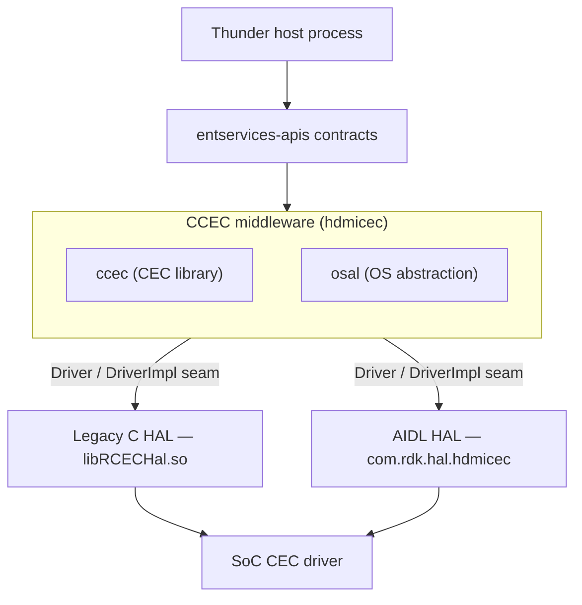
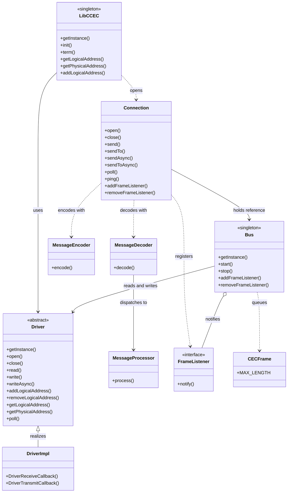

# hdmicec Architecture Overview

This document is the conceptual map of the `hdmicec` module: it explains **where the module sits in the RDK-V stack** and **how its parts relate**. `hdmicec` is the **CCEC C++ CEC middleware library (`ccec`) plus an OS Abstraction Layer (`osal`)**; it acts as the HDMI-CEC HAL **"Caller"** — it *consumes* a HAL beneath it and serves the Thunder service plugins above it, but it does **not** implement the HAL itself. `Source: hdmicec/rdk_env.xml`.

This overview is the starting point that the two sibling documents drill into: [`hal-interaction.md`](hal-interaction.md) details the two HAL backends, and [`data-flow.md`](data-flow.md) details the message paths and threading.

## Related documents

- [HAL Interaction](hal-interaction.md) — how CCEC talks to **both** HAL paths: the Legacy C HAL and the AIDL/Binder HAL.
- [Data Flow & Concurrency](data-flow.md) — outbound transmit / inbound receive sequences and the `Bus` producer/consumer threading model.
- [Module README](../../README.md) — module overview (purpose, key components, configuration, testing, and limitations).

---

## 1. Stack Placement

`hdmicec` occupies the **middleware** tier of the RDK-V HDMI-CEC software stack. Reading the stack top-to-bottom:

1. **Thunder host process** — the WPEFramework/Thunder web-server framework that hosts the CEC service plugins. `Source: README.md`.
2. **`entservices-apis` (contracts)** — the COM-RPC/JSON-RPC interface contracts the plugins expose to the rest of the system. `Source: README.md`.
3. **CCEC middleware (`ccec` + `osal`)** — *this module*. `ccec` provides the CEC library (lifecycle, connections, the message pipeline, and the abstract HAL contract), while `osal` provides the OS-abstraction primitives (threads, mutexes, condition variables, queues) that the library's transport is built on. `Source: hdmicec/rdk_env.xml`.
4. **`{ Legacy C HAL | AIDL HAL }`** — one of two interchangeable HAL backends beneath the middleware. The **Legacy C HAL** is the in-process C driver `hdmi_cec_driver.h` (shipped as `libRCECHal.so`), and the **AIDL HAL** is the out-of-process AIDL/Binder service `com.rdk.hal.hdmicec`. `Source: rdk-halif-hdmi_cec/include/hdmi_cec_driver.h`, `rdk-halif-aidl/hdmicec/current/com/rdk/hal/hdmicec/`.
5. **SoC CEC driver** — the vendor silicon driver that owns the physical CEC line. `Source: rdk-halif-aidl/hdmicec/current/docs/hdmi_cec.md`.

Because CCEC is the HAL **Caller**, the two HAL options are **alternative backends behind the same `Driver` abstract contract**: the middleware always calls `Driver`, and a single concrete `DriverImpl` adapts those calls to whichever HAL is present. This `Driver`/`DriverImpl` seam is the migration boundary from the legacy C API to AIDL/Binder, and it is examined in depth in [`hal-interaction.md`](hal-interaction.md). The module declares its build-time dependencies as `sdk` and `devicesettings`. `Source: hdmicec/rdk_env.xml`.

**Diagram 1 — Layered stack placement.**

The two HAL nodes are drawn as parallel siblings on purpose: at run time exactly one backend is active behind the single `Driver` abstraction, and the choice of backend is invisible to everything above the seam.

---

## 2. Component Inventory

The table below lists the key components of the module with their role and source path. Signatures are documented **exactly as they exist** in the current headers (document-as-is).

| Component | Role | Source |
|-----------|------|--------|
| `LibCCEC` | Library **facade** and lifecycle owner (**singleton**). API: `static LibCCEC & getInstance(void)`, `void init(const char * name = 0)`, `void term(void)`, `int getLogicalAddress(int devType)`, `void getPhysicalAddress(unsigned int *physicalAddress)`, `int addLogicalAddress(const LogicalAddress &source)`. | `hdmicec/ccec/include/ccec/LibCCEC.hpp` |
| `Connection` | Application-facing tap into the CEC bus (send/receive). API: `open()`, `close()`, `addFrameListener()` / `removeFrameListener()`, `send(const CECFrame&, int timeout = 0)`, `sendTo(const LogicalAddress&, const CECFrame&, int timeout = 0)`, `sendToAsync()`, `sendAsync()`, `poll()`, `ping()`, `getSource()` / `setSource()`. | `hdmicec/ccec/include/ccec/Connection.hpp` |
| `Bus` | Internal **singleton** producer/consumer transport with inner `Reader` / `Writer` threads. Holds `std::list<FrameListener*> listeners`, `EventQueue<CECFrame*> wQueue`, `Mutex rMutex` / `Mutex wMutex`; exposes `start()` / `stop()`. *(Implementation source — context only.)* | `hdmicec/ccec/src/Bus.hpp` |
| `Driver` | **Abstract**, pure-virtual HAL contract accessed via `static Driver & getInstance(void)`. Declares `open`, `close`, `read`, `write`, `writeAsync`, `addLogicalAddress`, `removeLogicalAddress`, `getLogicalAddress`, `getPhysicalAddress`, and `poll` (all pure virtual). | `hdmicec/ccec/include/ccec/Driver.hpp` |
| `DriverImpl` | The **single concrete adapter** of `Driver` — the migration seam. Provides static HAL callbacks `DriverReceiveCallback` / `DriverTransmitCallback` and an incoming `rQueue` (`typedef EventQueue<CECFrame*> IncomingQueue`). *(Implementation source — context only.)* | `hdmicec/ccec/src/DriverImpl.hpp` |
| `MessageEncoder` | Encodes high-level messages into `CECFrame` bytes via static `encode(...)` overloads. | `hdmicec/ccec/include/ccec/MessageEncoder.hpp` |
| `MessageDecoder` | Decodes a `CECFrame` back into a high-level message via `decode(const CECFrame&)`, dispatching the result through a `MessageProcessor` reference. | `hdmicec/ccec/include/ccec/MessageDecoder.hpp` |
| `MessageProcessor` | Base class with overloaded `process()` methods, one per message type; the default implementation discards, so applications **subclass** it to handle specific messages. | `hdmicec/ccec/include/ccec/MessageProcessor.hpp` |
| `FrameListener` | Observer interface: `virtual void notify(const CECFrame&) const = 0`. Paired with `FrameFilter::isFiltered(const CECFrame&)` for selective delivery. | `hdmicec/ccec/include/ccec/FrameListener.hpp` |
| `CECFrame` | Raw CEC frame buffer. Declares `enum { MAX_LENGTH = 128 }` and backs it with `uint8_t buf_[MAX_LENGTH]`. | `hdmicec/ccec/include/ccec/CECFrame.hpp` |
| OSAL primitives | `Thread`, `Mutex` / `AutoLock`, `ConditionVariable`, `EventQueue`, `Runnable`, `Stoppable` — the OS-abstraction building blocks used by `Bus` for its producer/consumer model. | `hdmicec/osal/include/osal/` |

> **Note on frame capacity.** `CECFrame` reserves `MAX_LENGTH = 128` bytes of buffer in code. `Source: hdmicec/ccec/include/ccec/CECFrame.hpp`. Real CEC messages are far smaller (on the order of ~16 bytes) — that small size is a characteristic of the **HDMI-CEC 1.4b protocol**, not a code constant. `Source: rdk-halif-aidl/hdmicec/current/docs/hdmi_cec.md`.

---

## 3. Class Relationships

The middleware wires its components into a single downward call chain from the facade to the HAL, with the message pipeline and the observer contract attached at the application-facing edge:

- **`LibCCEC`** owns the module lifecycle (`init` / `term`) and answers address queries (`getLogicalAddress`, `getPhysicalAddress`, `addLogicalAddress`); internally it drives the HAL through the `Driver` singleton. `Source: hdmicec/ccec/include/ccec/LibCCEC.hpp`.
- **`Connection`** is the application's handle onto the CEC bus. It holds a reference to the `Bus` singleton (`Bus &bus`) and registers a private `DefaultFrameListener` (guarded by a private `DefaultFilter`) so that received frames are routed back to the application. `Source: hdmicec/ccec/include/ccec/Connection.hpp`.
- **`Bus`** (singleton) is the actual transport. It calls `Driver::getInstance()` to perform the real `read()` / `write()`, keeps the registered `listeners`, buffers outbound frames in `EventQueue<CECFrame*> wQueue`, and runs its inner `Reader` and `Writer` — each declared `: public Runnable, public Stoppable`. `Source: hdmicec/ccec/src/Bus.hpp`.
- **`Driver`** is abstract; **`DriverImpl`** is its single concrete subclass and the seam to the HAL, exposing the static `DriverReceiveCallback` / `DriverTransmitCallback` entry points and buffering inbound frames in its `rQueue`. `Source: hdmicec/ccec/include/ccec/Driver.hpp`, `hdmicec/ccec/src/DriverImpl.hpp`.
- **`MessageEncoder`**, **`MessageDecoder`**, and **`MessageProcessor`** sit on the *application* side of `Connection`: the encoder turns a high-level message into a `CECFrame` for sending, the decoder reconstructs a message from a received `CECFrame`, and the processor (subclassed by the application) handles it. **`FrameListener`** is the observer contract over which received frames are delivered. `Source: hdmicec/ccec/include/ccec/MessageEncoder.hpp`, `hdmicec/ccec/include/ccec/MessageDecoder.hpp`, `hdmicec/ccec/include/ccec/MessageProcessor.hpp`, `hdmicec/ccec/include/ccec/FrameListener.hpp`.

**Diagram 2 — Component / class relationships.** The diagram is anchored on the real `Driver` (abstract) → `DriverImpl` (concrete) inheritance seam.

---

## 4. Responsibility Split (Middleware vs HAL)

The boundary between `hdmicec` and the HAL beneath it follows the RDK HDMI-CEC contract precisely:

- **CCEC middleware owns the CEC *high-level* protocol** — device discovery, logical-address allocation, and message semantics (encoding, decoding, and dispatch through the `Message*` pipeline). `Source: rdk-halif-aidl/hdmicec/current/docs/hdmi_cec.md`.
- **The HAL owns the CEC *low-level* protocol** — electrical timing, bus arbitration, retries, and ACK sampling — as defined by HDMI-CEC 1.4b. `Source: rdk-halif-aidl/hdmicec/current/docs/hdmi_cec.md`.

Crucially, the HAL treats frames as **opaque**: the caller (the middleware) must pass **fully-formed** message frames — a header block and its data blocks — and the HAL neither parses nor interprets their command-level meaning. All opcode/operand parsing and semantics therefore live in the middleware. `Source: rdk-halif-aidl/hdmicec/current/docs/hdmi_cec.md`. This clean split is exactly what lets the `Driver`/`DriverImpl` seam swap the Legacy C HAL for the AIDL/Binder HAL without changing any middleware logic; the two backends are compared side-by-side in [`hal-interaction.md`](hal-interaction.md).

---

## 5. Design Patterns

The module's structure is best understood through five recurring patterns, each tied to a concrete component:

- **Layered architecture** — CCEC is a well-defined middleware layer between the Thunder service plugins above and the HAL below, communicating with each through a narrow, explicit contract. `Source: hdmicec/rdk_env.xml`.
- **Adapter / migration seam** — the abstract `Driver` contract plus the concrete `DriverImpl` adapter isolate the middleware from any specific HAL implementation, which is what enables the Legacy-C-to-AIDL migration to happen behind a stable interface. `Source: hdmicec/ccec/include/ccec/Driver.hpp`, `hdmicec/ccec/src/DriverImpl.hpp`.
- **Producer/consumer** — the `Bus` runs inner `Reader` and `Writer` threads over an `EventQueue<CECFrame*> wQueue`, decoupling the callers that enqueue frames from the thread that drains the queue to the HAL. `Source: hdmicec/ccec/src/Bus.hpp`.
- **Observer** — inbound frames are delivered through the `FrameListener` interface (`notify(const CECFrame&)`), letting multiple application listeners subscribe without the transport knowing their concrete types. `Source: hdmicec/ccec/include/ccec/FrameListener.hpp`.
- **Singleton** — the module's shared, process-wide services — `LibCCEC`, `Bus`, and `Driver` — are each reached through a `getInstance()` accessor, guaranteeing a single instance of the facade, the transport, and the HAL adapter. `Source: hdmicec/ccec/include/ccec/LibCCEC.hpp`, `hdmicec/ccec/src/Bus.hpp`, `hdmicec/ccec/include/ccec/Driver.hpp`.

---

*For the two HAL backends and the migration seam in detail, continue to [HAL Interaction](hal-interaction.md); for the transmit/receive sequences and the `Bus` threading model, see [Data Flow & Concurrency](data-flow.md). For module-level context, return to the [Module README](../../README.md).*
